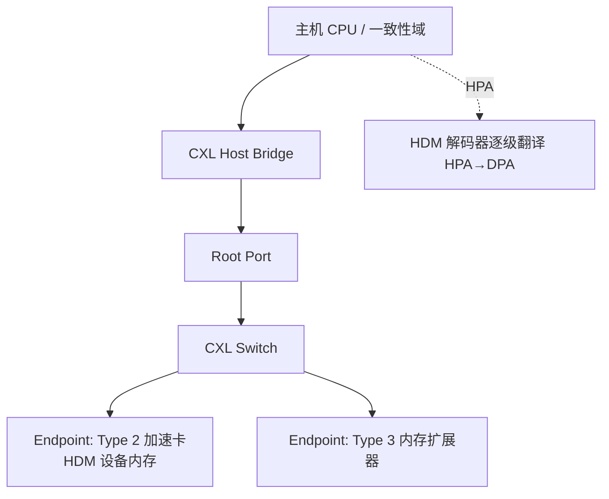
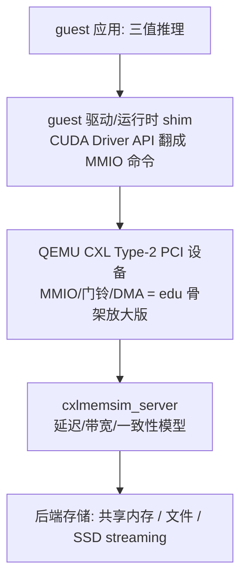

# 在 QEMU 里建模加速卡，与 Compute Express Link 完备指南

!!! note "主要贡献者"

    - 作者：[@Lfan-ke](https://github.com/Lfan-ke)

---

src：[CXL 官网](https://computeexpresslink.org)，[QEMU CXL 文档](https://www.qemu.org/docs/master/system/devices/cxl.html)，[QEMU edu 设备](https://www.qemu.org/docs/master/specs/edu.html)，[CXLMemSim](https://github.com/SlugLab/CXLMemSim)

这篇笔记讲两件事，再把它们合到一起。第一件：QEMU 怎么把一块并不存在的硬件"变"出来，让 guest 里的驱动以为自己在跟真芯片说话 - 也就是怎么从零建模一块设备/加速卡。第二件：Compute Express Link（CXL）是什么、解决什么问题、协议与一致性怎么设计、设备分几类、在 QEMU 里怎么仿真。最后合起来讲训练营 stage3 的 CXLEmu 方向：建模一块 CXL 内存型 AI 加速卡，在上面跑三值大模型推理，按吞吐打榜。

读法：第一部分从最小可用的教学设备 `edu` 一路讲到真加速卡该有的部件，是"怎么造"；第二部分是"造的是什么样的一块卡"的行业标准；第三部分把两者接起来。三部分各自自洽，可单独看。

---

## 一、在 QEMU 里建模一块设备 / 加速卡

### 1.1 先想清楚：设备模型到底在模拟什么

QEMU 跑 guest 有两条路：TCG（纯软件翻译执行 guest 指令）或 KVM（借硬件虚拟化直接跑）。不管哪条，CPU 只负责取指执行；一块"设备"对 guest 的全部存在感，来自两样东西：

- guest 能读写的一片地址（寄存器 / BAR 空间）。guest 的 load/store 落到这片地址，不是访问内存，而是被路由到你写的回调函数。
- 设备能反向影响 guest 的手段：往 guest 内存搬数据（DMA）、拉一根中断线（IRQ）。

所以"建模一块加速卡"本质就是：声明一个对象，给它一片寄存器地址，写好"guest 读这个寄存器返回什么 / 写这个寄存器触发什么动作"，再补上 DMA 和中断。硬件的时序、门电路、物理实现全都不用管 - 只要行为（寄存器语义）对得上驱动的预期即可。这也是为什么一块几百行的 C 文件就能冒充一整块 PCI 卡。

### 1.2 QOM：QEMU 的对象模型

QEMU 里一切可实例化的东西（CPU、设备、总线、后端）都是 QOM 对象。建模设备第一步是注册一个类型。核心是 `TypeInfo`：

- `.name`：类型名，字符串（如 `"edu"`）。
- `.parent`：父类型。设备通常继承 `TYPE_PCI_DEVICE`（PCI 卡）或 `TYPE_SYS_BUS_DEVICE`（平台/片上设备）。
- `.instance_size`：实例结构体大小，QEMU 按它分配。
- `.instance_init`：每个实例创建时调用，做最轻的初始化（设默认值、加属性），此时还不能碰总线/内存。
- `.class_init`：类型第一次用到时调用一次，填类的虚函数表（realize、reset、PCI 的 vendor/device id 等）。

注册用 `type_register_static(&info)`，再用 `type_init(fn)` 宏把注册函数挂到 QEMU 启动的模块初始化链上。类型之间是继承树：一个 `edu` 对象同时"是"一个 `PCIDevice`、也"是"一个 `DeviceState`、最终"是"一个 `Object`，可以逐层向上 cast。

instance_init 与 class_init 的分工要记牢：class 级别的东西（这类设备的行为）只初始化一次，所有实例共享；instance 级别的东西（这一块卡的状态）每个实例各一份。

### 1.3 qdev：设备这一层

QOM 之上，`DeviceState` / `DeviceClass` 加了"设备"专属的生命周期：

- `realize()`：设备真正上线的钩子（class_init 里把它填进 `DeviceClass.realize` 或 PCI 的 `PCIDeviceClass.realize`）。分配资源、建内存区、注册 BAR、起线程、初始化中断都在这里。realize 失败要通过 `Error **errp` 报错回滚。
- 属性（property）：设备的可配参数，命令行 `-device edu,dma_mask=...` 能设。用 `DEFINE_PROP_*` 声明静态属性，或 `object_property_add_*` 动态加。
- `reset`：guest 复位时把设备寄存器打回初值。

一块加速卡的"出厂"过程就是它的 realize：把寄存器窗口铺好、DMA 掩码设好、中断初始化好、计算引擎（线程/定时器）拉起来。

### 1.4 挂在哪条总线：SysBus vs PCI

两种最常见的挂法，决定 guest 怎么发现这块卡：

|挂法 | 父类型|guest 怎么发现 | 典型场景|
|:--:|:--:|:--:|:--:|
|平台设备|`TYPE_SYS_BUS_DEVICE`|地址写死在设备树 / 机器代码里 | 片上外设（SoC 里的 UART、GPIO、加速器 IP）|
|PCI 设备|`TYPE_PCI_DEVICE`|枚举 PCI 配置空间（vendor/device id）| 插槽卡（网卡、GPU、CXL 卡）|

SysBus 设备在 realize 里用 `sysbus_init_mmio()` 登记寄存器区、`sysbus_init_irq()` 登记中断线，机器代码再把它映到某个物理地址、接到某个中断控制器。PCI 设备则由 PCI 子系统自动分配地址（BAR）和中断，guest 的 PCI 枚举会读到它的配置空间。

PCI 卡在 class_init 里要填身份：`vendor_id` / `device_id`（驱动靠这对 id 认卡）、`class_id`（设备大类）、`revision`。配置空间是标准化的一片 256 字节（PCIe 扩展到 4KB），描述 BAR、中断脚、能力链表（MSI/MSI-X 等）。

### 1.5 寄存器与 MMIO：guest 的读写怎么到你手里

设备的寄存器窗口是一个 `MemoryRegion`，行为由 `MemoryRegionOps` 定义：

```c
static const MemoryRegionOps edu_mmio_ops = {
    .read = edu_mmio_read,          // guest 读某偏移 -> 返回值
    .write = edu_mmio_write,        // guest 写某偏移 -> 触发动作
    .endianness = DEVICE_NATIVE_ENDIAN,
    .valid = { .min_access_size = 4, .max_access_size = 8 },  // 允许的访问宽度
    .impl  = { .min_access_size = 4, .max_access_size = 8 },  // 回调按什么宽度收
};
```

- `.read(opaque, addr, size)`：`addr` 是相对本区的偏移，返回值就是 guest 读到的内容。
- `.write(opaque, addr, val, size)`：guest 写进来的值，在这里解释成命令。
- `.valid` / `.impl`：门卫。`.valid` 限定 guest 合法访问宽度（不合法的访问被拦），`.impl` 声明回调实际按几字节实现，QEMU 负责把不匹配的宽度拆合。endianness 决定字节序转换。

建区并挂成 BAR（在 realize 里）：

```c
memory_region_init_io(&edu->mmio, OBJECT(edu), &edu_mmio_ops, edu, "edu-mmio", 1 * MiB);
pci_register_bar(pdev, 0, PCI_BASE_ADDRESS_SPACE_MEMORY, &edu->mmio);
```

一次 guest MMIO 读写的完整链路：guest 驱动 `writel(reg, val)` -> CPU 发出对该物理地址的存储 -> QEMU 内存分发（softmmu）发现这段地址属于设备区、不是 RAM -> 调用 `edu_mmio_write(edu, 偏移, val, 4)`。没有真总线、没有真时序，一次函数调用而已。寄存器地图（哪个偏移是命令、哪个是状态、哪个是数据）就是设备和驱动之间的全部契约。

### 1.6 DMA：设备反向读写 guest 内存

寄存器只能搬几个字节，批量数据靠 DMA - 设备直接读写 guest 的物理内存。QEMU 提供的接口：

- PCI 设备：`pci_dma_read(dev, 客户物理地址, 本地缓冲, len)` / `pci_dma_write(...)`。
- 通用：`dma_memory_read/write(as, ...)`、`address_space_rw(as, ...)`，走设备所属的 `AddressSpace`（若前面有 IOMMU，地址会被翻译，这正是隔离所在）。

关键纪律是边界检查：DMA 地址由 guest 通过寄存器给进来，设备必须自己核对范围，否则越界写就是漏洞。教学设备 `edu` 的做法很典型：DMA 只允许打到它自己 1MiB 窗口里 `DMA_START`（0x40000）起的一段，`edu_check_range()` 逐次校验，还用 `dma_mask` 把地址钳进合法位宽：

```c
static void edu_dma_timer(void *opaque) {
    EduState *edu = opaque;
    if (!(edu->dma.cmd & EDU_DMA_RUN)) return;
    if (EDU_DMA_DIR(edu->dma.cmd) == EDU_DMA_FROM_PCI) {          // guest RAM -> 设备
        edu_check_range(edu->dma.dst, edu->dma.cnt, DMA_START, DMA_SIZE);
        pci_dma_read(&edu->pdev, edu_clamp_addr(edu, edu->dma.src),
                     edu->dma_buf + (edu->dma.dst - DMA_START), edu->dma.cnt);
    } else {                                                       // 设备 -> guest RAM
        ...
        pci_dma_write(&edu->pdev, edu_clamp_addr(edu, edu->dma.dst), ...);
    }
    edu->dma.cmd &= ~EDU_DMA_RUN;
    if (edu->dma.cmd & EDU_DMA_IRQ) edu_raise_irq(edu, DMA_IRQ);   // 搬完拉中断
}
```

一个 DMA 引擎的标准四寄存器：源地址、目的地址、字节数、命令（含方向位、启动位、完成中断位）。驱动填好前三个、往命令寄存器写"启动"，设备搬完把 RUN 位清掉并按需拉中断。真加速卡的 DMA 更复杂（描述符链、分散聚集），但骨架就是这个。

### 1.7 中断：怎么通知 guest "我干完了"

设备干完活要通知 CPU，两条路：

- 传统 INTx：一根共享电平线，`pci_set_irq(dev, 1)` 拉高、`pci_set_irq(dev, 0)` 拉低。多设备共线，驱动得读状态寄存器辨认是谁。
- MSI / MSI-X：基于消息的中断，设备"写一个约定地址"即触发，无需共享线、向量多。`msi_init()` 在 realize 里声明能力，`msi_notify(dev, 向量)` 发一次。

`edu` 把两者封在一处，有 MSI 用 MSI、否则回落 INTx：

```c
static void edu_raise_irq(EduState *edu, uint32_t val) {
    edu->irq_status |= val;
    if (edu->irq_status) {
        if (msi_enabled(&edu->pdev)) msi_notify(&edu->pdev, 0);
        else pci_set_irq(&edu->pdev, 1);
    }
}
```

配一个 `irq_status` 寄存器让驱动读"为什么中断"，再配一个"清中断"的写寄存器（`edu` 里 0x64），是标准做法。

### 1.8 别卡住 vCPU：后台干活

设备回调运行在持有大锁（iothread mutex / BQL）的上下文里。如果一个 MMIO 写触发的是一段长计算，直接在回调里算完会把整个 VM 卡死。三种放到后台的手段：

- `QEMUTimer`：把动作延后到虚拟时钟某点（`edu` 的 DMA 就用定时器模拟"搬运需要时间"，写命令寄存器只是 `timer_mod` 排期，真正搬在 timer 回调里）。
- 工作线程：`qemu_thread_create` 起一条线程算重活，算完再回主循环拉中断。`edu` 的阶乘计算就单开一条线程，guest 写数进去、线程慢慢算、状态寄存器置"计算中"，逼驱动轮询状态 - 演示的正是真硬件"命令异步完成"的语义。跨线程碰 guest 状态/中断要重新拿 iothread 锁。
- 下半部（bottom half，`qemu_bh_*`）：把动作推迟到主循环下一轮，轻量异步。

对加速卡这条尤其重要：一次推理 kernel 不可能在 MMIO 回调里同步跑完，必然是"驱动下命令 -> 设备后台算 -> 完成拉中断 -> 驱动取结果"。

### 1.9 迁移：把设备状态也带走

要支持热迁移/快照，设备得声明哪些字段属于"状态"，用 `VMStateDescription` + `VMSTATE_*` 列出寄存器和内部状态字段，QEMU 负责序列化/反序列化。纯教学设备可以不做，真设备必须做，否则迁移后设备状态丢失。

### 1.10 通读 edu：一块"最小加速卡"

把上面所有件事在教学设备 `hw/misc/edu.c` 里对号入座，就是完整一块 PCI 卡：

|部件|edu 里的落点|
|:--:|:--:|
|QOM 注册|`TypeInfo{ .name="edu", .parent=TYPE_PCI_DEVICE, .instance_init, .class_init }` + `type_init`|
|身份|class_init 填 `vendor_id=PCI_VENDOR_ID_QEMU`、`device_id=0x11e8`|
|上线|`pci_edu_realize`：`msi_init` + `timer_init_ms` + 起计算线程 + `memory_region_init_io` + `pci_register_bar`|
|寄存器图|0x00 版本号、0x04 写入取反回读、0x08 阶乘计算、0x20 状态、0x24 中断状态、0x60 拉中断、0x64 清中断、0x80/88/90/98 DMA 源/目的/计数/命令|
|计算引擎|`edu_fact_thread` 后台算阶乘，`status` 的 COMPUTING 位表示忙|
|DMA 引擎|`edu_dma_timer` + `pci_dma_read/write` + `edu_check_range` 边界 + `dma_mask` 钳位|
|中断|`edu_raise_irq/lower_irq`，MSI 优先、回落 INTx|
|属性|`dma_mask` 通过 `object_property_add_uint64_ptr` 暴露给命令行|

它故意用线程 + 状态位逼驱动"下命令 - 轮询/等中断 - 取结果"，就是要教对硬件异步语义的正确写法。学会 edu，就掌握了建模任意一块卡的全部骨架。

### 1.11 从 edu 到真加速卡还差什么

edu 是玩具，一块真 AI 加速卡在这套骨架上会加：

- 多个 BAR：一个放控制寄存器（MMIO），一个放大片设备内存（显存 / HBM，可被 guest 直接映射）。
- 命令队列而非单寄存器：guest 在一段环形缓冲里排命令，写门铃（doorbell）寄存器通知设备批量取，取代 edu 那种一次一命令。
- 描述符链 DMA：分散聚集（scatter-gather），一次搬多段不连续内存。
- 计算核心：矩阵乘/卷积/注意力的实现（真跑数值，或转调宿主库/GPU）。
- 设备内存的一致性：显存要不要和 CPU 缓存保持一致？这一步就把我们引向了 CXL - 因为让"加速卡自带内存"与主机内存一致地互访，正是 CXL 要解决的问题。

### 1.12 真给 guest 一块 GPU：QEMU 的三条实路

edu 教的是建模一块设备的骨架。但真要让 guest 用上 GPU，实践里 QEMU 并不去逐件建模一块现代 GPU 的内部 - 它走的是另外三条路，各有取舍：

- 半虚拟化图形（virtio-gpu）：guest 里装一块 virtio-gpu，图形命令经 virtio 队列送到宿主，宿主用 virglrenderer 把 guest 的 OpenGL 翻成宿主 GL、用 Venus 把 Vulkan 转过去。这是"图形"路，主打显示与渲染，不是通用计算。
- 设备直通（VFIO）：把一块真物理 GPU 整个 passthrough 给 guest（或用 SR-IOV 的 VF、mdev/vGPU 把一块卡切成多份），guest 装原厂驱动直接跑。QEMU 此时不模拟 GPU 内部，只借 IOMMU 做地址隔离、转发 BAR 与中断。性能最好，代价是卡的归属较独占。
- 计算 offload：guest 里放一块薄设备 + 一层 shim，把 CUDA / 计算请求转发到宿主 GPU 或一个行为模型（cmodel）去算 - 这正是本篇 CXLEmu 要走的路。

一句诚实话：QEMU 从不逐周期建模一块现代 GPU 的计算内部（太复杂、又闭源）。想在纯模拟器里研究 GPGPU 的微架构，得用周期级模型，比如 gem5，或读开源的 RISC-V GPGPU Vortex（自带 SimX 周期级模拟器 + RTL + FPGA，跑 OpenCL / Vulkan / HIP）那样把软硬件全栈都摊开的项目。而本篇选第三条 offload 路，配一块自带一致内存的 CXL 卡 - 话题就交给第二部分的 CXL。

---

## 二、Compute Express Link（CXL）

第一部分教会了怎么造一块卡。这一部分讲一个具体的、正在重塑数据中心的卡与内存标准 - CXL - 它恰好是"加速卡自带内存要和主机一致互访"这个问题的行业答案。

### 2.1 CXL 要解决什么

PCIe 能在 CPU 和设备之间搬数据，但搬来的数据不进主机的缓存一致性域：设备想读主机内存、或让主机读设备上的内存，都得靠驱动显式 DMA 拷贝，两边看到的不是同一份一致的内存。数据中心因此有几个老大难：

- 加速器（GPU / FPGA / AI 卡）想和 CPU 一致地共享内存，而不是来回拷。
- 单机内存的容量和带宽被 DDR 通道数卡死，加内存只能加整台机器。
- 内存和算力被绑死在每台机器里，用不满就"搁浅"（stranding）- 一台机器内存告急、隔壁机器内存闲置也调不过来。
- 多机想细粒度共享一片内存做协同计算，没有硬件手段。

CXL 是一个开放的、缓存一致的互联标准，在 PCIe 之上加了一致性与内存语义，让"设备内存 / 扩展内存"能像本地内存一样被 load/store 访问，带宽随 PCIe 走、延迟比走 PCIe 协议低得多。它正对上面四件事：一致访问系统与设备内存、内存带宽容量扩展、靠池化消解搁浅、跨机细粒度共享。

### 2.2 物理基础：架在 PCIe 上

CXL 不另起炉灶，直接复用 PCIe 的物理层，CXL 卡就插在 PCIe 插槽里、和 PCIe 完全互通。链路先按 PCIe Gen1 的 2.5 GT/s 训练起来，再用 PCIe 5.0/6.0 规范里的"备用协议协商"机制把工作协议切成 CXL。一个多协议 PHY 动态复用 CXL 的三条子协议。

速率跟着 PCIe 走：CXL 1.x/2.0 用 PCIe 5.0 电气层，32 GT/s；CXL 3.0 用 PCIe 6.0，PAM-4 四电平调制，翻倍到 64 GT/s（x16 聚合原始带宽可达约 256 GB/s 量级）。传输以 FLIT（流控单元）为粒度：CXL 1.0/1.1/2.0 用 68 字节 FLIT（2 字节协议 ID + 64 字节负载分四个 16 字节槽 + 2 字节 CRC）；CXL 3.0 在 64 GT/s 下用 256 字节 FLIT，复用 PCIe 6.0 的 Reed-Solomon FEC 结构。

### 2.3 三条协议：一根链路上复用

CXL 由三条子协议动态复用在同一物理层上，Arb/Mux 仲裁模块把它们分成两摞：CXL.io 一摞，CXL.cache 和 CXL.mem 合成一摞（都是 FLIT 原生、在链路层区分）。

|协议 | 干什么 | 方向/语义 | 谁必须有|
|:--:|:--:|:--:|:--:|
|CXL.io|设备发现、配置、初始化、I/O 虚拟化、DMA|就是 PCIe（TLP/DLLP 原样搬），非一致 load/store|所有设备强制|
|CXL.cache|让设备一致地缓存主机内存|MESI、64 字节缓存行；H2D / D2H 各含 Req/Rsp/Data 三通道 | 可选|
|CXL.mem|让主机（及别的设备）访问设备内存（HDM）当可缓存内存|M2S 发 MemRd/MemWr、S2M 回 MemData；主机是主、设备是从 | 可选|

一块卡实现哪几条，决定了它是哪一类设备（下面 2.5）。

### 2.4 一致性模型：非对称，主机说了算

和 UPI/NVLink 那种对称一致性不同，CXL 走非对称一致性：主机处理器统一编排缓存一致性，设备侧只跑一个简单的 MESI 缓存代理，命令集很小。这样设备实现简单、也不必懂主机特定的一致性细节。

设备暴露给主机的内存叫 HDM（Host-managed Device Memory，主机管理的设备内存），有三种成色：

- HDM-H：纯主机一致（Type 3 内存扩展器的内存），设备自己不缓存它。
- HDM-D：设备管理、需要 Bias 流的一致（早期 Type 2 加速器内存）。
- HDM-DB：CXL 3.0 新增，带 Back-Invalidate 支持的设备一致内存（Type 2/3 都可用）。

早期（CXL 1.1/2.0）Type 2 的设备内存一致性靠 Bias（偏置）机制，由设备端 DCOH 代理管理。偏置本身是两态、按 HDM 页跟踪：主机偏置（Host Bias，设备访问自己这页 HDM 也要过一趟主机一致性检查）与设备偏置（Device Bias，设备独占该页、直接访问不往返主机，快）。这跟 CXL.mem 目录里按缓存行携带的状态（该行是否被主机共享 / 可能任意缓存）是两套东西，别混。要从设备偏置翻回主机偏置（Bias Flip），得让主机把设备独占过的行回收。

CXL 3.0 用增强一致性（enhanced coherency）取代 Bias 机制：CXL.mem 新增两条通道 - S2M 方向的 Back-Invalidate Snoop（BISnp）和 M2S 方向的 Back-Invalidate Response（BIRsp）- 让设备能反向把主机缓存里的行作废（back-invalidate）。这带来三件大事：Type 2 设备可以实现 Snoop Filter 高效管理更大的 HDM（不用把整片 HDM 都跟踪）、设备间可绕过主机直接点对点访问 HDM、以及跨多个独立主机的硬件一致内存共享。

### 2.5 三类设备

CXL 在 1.0/1.1 就定义了三类设备，按"有没有 cache、有没有自带内存、用哪几条协议"分：

|类型 | 是什么 | 协议 | 设备内存 | 典型|
|:--:|:--:|:--:|:--:|:--:|
|Type 1|带缓存的加速器，无自带（主机管理的）内存|io + cache|无 | 智能网卡|
|Type 2|自带内存的加速器|io + cache + mem|有（HDM-D / HDM-DB）|GPU、FPGA、AI 加速卡|
|Type 3|内存扩展 / 带宽扩展器，无计算|io + mem|有（HDM-H / HDM-DB）|CXL 内存条 / 内存池|

这篇要建模的"AI 加速卡"就是 Type 2：既有自己的设备内存（放权重 / KV），又要和主机一致地互访。真实产品里 Type 3 已量产（三星 CMM-D 的 E3.S DDR5 内存模组、Astera Labs Leo 内存控制器、H3 Falcon 这类可在多主机间池化 / 热插拔的内存池设备）。

### 2.6 拓扑与地址翻译

CXL 的连接结构像 PCIe 的树（3.0 起还能是非树 fabric）：主机上有 CXL Host Bridge，下挂 Root Port，可再经 Switch 的上/下行端口，最后到 Endpoint（Type 1/2/3 设备）。

系统把一段主机物理地址（HPA）划给 CXL，靠一串 HDM 解码器逐级把地址路由/翻译下去：

- 根解码器（root）：固件给的、平台级的 CXL 地址窗口。
- 交换机解码器（switch）：在上下行端口间路由，可配交织。
- 端点解码器（endpoint）：不路由，只把进来的 HPA 翻成设备本地的设备物理地址（DPA）。

Linux 把这条链组织成"region"，协调从主机桥经交换机到端点的交织宽度与粒度。一段内存可以在多台设备间按粒度交织以叠加带宽。



### 2.7 用途图谱

同一套 CXL.mem，配不同拓扑与代际，长出四种用法：

- 内存扩展：Type 3 给单机加内存，绕开 DDR 通道数上限，成本/功耗/引脚更省。
- 内存池化（CXL 2.0 起）：把 CXL 内存当可流转资源，按需分给机架里不同主机、不重启，某一刻一段仍只归一个主机所有，消解搁浅。
- 内存共享（CXL 3.0 起）：一段内存靠硬件一致性同时被多主机访问、都看到最新值，不用软件协调，支撑共享内存式的集群计算。
- 内存分层（tiering）：CXL 内存作为比本地 DRAM 慢的一层，操作系统按 NUMA 节点 + ACPI HMAT 描述的性能属性把冷热数据分层放置。

CXL 3.0 还引入非树 fabric（Port Based Routing，最多 4096 节点）与 GFAM（全局 fabric 挂载内存，一个类 Type-3 设备可被最多 4095 个节点访问），把内存从处理单元彻底解耦成共享池。

### 2.8 版本演进

|版本 | 发布 | 物理层 / 速率 | 头条特性|
|:--:|:--:|:--:|:--:|
|CXL 1.0|2019-03|PCIe 5.0 / 32 GT/s|三协议、三类设备、单机|
|CXL 1.1|2019|PCIe 5.0 / 32 GT/s|加合规 / 一致性测试|
|CXL 2.0|2020-11|PCIe 5.0 / 32 GT/s|单级交换、内存 / 设备池化、热插拔、MLD（≤16 逻辑设备）、Fabric Manager、CDAT、全局持久刷新|
|CXL 3.0|2022-08|PCIe 6.0 / 64 GT/s（PAM-4）|多级交换与 fabric、内存共享、Back-Invalidate 增强一致性、GFAM、PBR（≤4096 节点）、256B FLIT|
|CXL 3.1|2023-11|PCIe 6.0 / 64 GT/s|Fabric 增强、PBR 交换机 FM API、主机间通信、TSP 可信执行安全、扩展元数据（每行≤32 位）|
|CXL 3.2|2024-12|PCIe 6.0 / 64 GT/s|CHMU 热页监控（配内存分层）、在线固件激活、PPR 增强、更多性能计数器、TSP / IDE 安全扩展|

联盟 2019-03 由 Intel 联合八家（阿里巴巴、Cisco、Dell、Google、华为、Meta、Microsoft、HPE）发起，Intel 把 IAL 规范捐作 CXL 1.0；后来 Gen-Z、OpenCAPI 把 IP 并入 CXL，成员发展到数百家。各代向后兼容。

### 2.9 在 QEMU 里仿真 CXL

把第一部分的设备建模落到 CXL 具体设备上：QEMU 已经能整套仿真 CXL 拓扑，无需真硬件就能开发 / 测试 Linux 的 CXL 子系统、内存分层、`cxl-cli` 工具链。开关在 q35 机器上 `-M q35,cxl=on`。拓扑对象都是 QOM/PCI 设备模型：

|命令行对象 | 建模的东西|
|:--:|:--:|
|`pxb-cxl`|CXL Host Bridge（一条 CXL 层级的根）|
|`cxl-rp`|CXL Root Port（挂在 host bridge 上）|
|`cxl-upstream` / `cxl-downstream`|CXL 交换机的上 / 下行端口|
|`cxl-type3`|Type 3 内存扩展设备|

Type 3 设备背后接一个内存后端对象：持久内存用 `memory-backend-file`、易失内存用 `memory-backend-ram`，持久设备还要一个 LSA（标签存储区）后端。一段最小的 Type 3 命令看起来像：

```
-M q35,cxl=on \
-object memory-backend-ram,id=vmem0,share=on,size=256M \
-device pxb-cxl,bus_nr=12,bus=pcie.0,id=cxl.1 \
-device cxl-rp,port=0,bus=cxl.1,id=rp0,chassis=0,slot=2 \
-device cxl-type3,bus=rp0,volatile-memdev=vmem0,id=cxl-vmem0 \
-M cxl-fmw.0.targets.0=cxl.1,cxl-fmw.0.size=4G
```

几个关键件：

- CFMW（CXL Fixed Memory Window）：机器级 `-M cxl-fmw.*` 参数，把一段主机物理地址路由到某个（或交织到多个）CXL host bridge，可设交织粒度。这就是给 CXL 划的那扇 HPA 窗口。
- HDM 解码器：在仿真的 Type 3 端点里，解码器不做路由、只把进来的 HPA 翻成 DPA。
- CDAT：`cxl-type3` 的 `cdat` 属性可用文件覆盖设备的一致性属性表。
- 事件 / 错误注入：`qapi/cxl.json` 定义了一套 QMP 命令往仿真设备里注入 CXL 事件、毒化（poison）、可纠正 / 不可纠正错误，事件日志分 informational / warning / failure / fatal 四级，还支持动态容量设备（DCD）的增删。这让你不碰真硬件就能测驱动的 RAS 路径。

guest 侧，Linux 的 CXL 子系统（`drivers/cxl`）由 `cxl_pci` / `cxl_mem` / `cxl_port` / `cxl_acpi` 几个协作驱动组装出解码拓扑，把设备呈现在 `/sys/bus/cxl/devices/`（`portN` / `decoderN.M` / `memN` / `regionN`），用户态用 `cxl-cli`（ndctl 项目）建 region、配成 devdax 或 system-ram。QEMU 这套 CXL 仿真主要由 Jonathan Cameron（华为）维护。

## 三、CXLEmu：建模一块 CXL 内存型 AI 加速卡

现在把两部分接起来。训练营 stage3 的 CXLEmu 方向，就是"用第一部分的手法，建模第二部分那种 Type 2 CXL 加速卡，在上面跑大模型推理，比谁喂数据喂得快"。

### 3.1 方向定义

在 QEMU + CXLMemSim 搭出的 CXL Type-2 加速器仿真上，跑三值（1.58 bit）大模型推理（经一层 CUDA shim + 三值后端），官方点名的核心优化对象是 back storage / 供数路径（把权重从设备/后端内存喂进计算单元的那条路），按推理 tps（每秒 token）打榜。

### 3.2 为什么加速卡要 CXL Type-2

一块 AI 加速卡自带设备内存（放权重和 KV cache），又要和主机一致地互访 - 这正是 Type 2 的定义（io + cache + mem，HDM-D/HDM-DB）。大模型即便三值量化后总量仍巨大，装不下就得靠 CXL 那套内存扩展 / 供数能力把权重源源不断喂上来。于是"加速卡 + CXL 设备内存 + 供数路径"成了一个可建模、可优化的完整对象。

### 3.3 CXLMemSim 是什么

CXLMemSim（GitHub `SlugLab/CXLMemSim`）要分两层理解，别当成单一东西：

- 起点（2023 论文，arXiv 2303.06153）：一个纯软件的 CXL.mem 性能模拟器，挂到未改动的应用上，用 `perf_event_open` 采样（Intel PEBS + CHA PMU、AMD IBS）把执行切成 epoch、按 epoch 注入时延来模拟 CXL.mem 的延迟 / 带宽。它不是逐周期硬件模型，比 gem5 这类周期精确模拟器快数量级。
- 现在的仓库：长成了双模框架 - 一个延迟 / 带宽 / 拓扑 / 一致性（MESI 式目录）模拟核心（拓扑用 Newick 树记法，`CXLController` 持有拓扑 / 端点 / 策略 / 延迟模型），外加一套 QEMU 集成的 CXL 仿真栈，以 `cxlmemsim_server` 暴露。仓库自述已推进到"CXL 3.0 内存系统"的仿真与刻画。

它和 QEMU 的关系是配合、不是替代：QEMU 提供 guest 面前那块 CXL 设备（用的正是第一部分讲的 PCI 设备 / MMIO 建模），把内存操作转发给 `cxlmemsim_server` 去算延迟和供数。对 Type 2 GPU 场景，CUDA Driver API 调用被翻译成 QEMU 上一块 CXL Type-2 PCI 设备的 MMIO 命令 - 也就是说，那块"加速卡"的寄存器 / 门铃 / DMA，本质就是 1.10 节 `edu` 那套骨架的放大版。

一块"加速卡"从来不是单一部件，而是一条链的合成。训练营这条链是现成组件的拼装：guest 里跑 llama.cpp 的量化分支（`ik_llama.cpp`）当负载，`Zettai-US/qemu-cxl-type2` 提供 QEMU 侧的 CXL Type-2 设备扩展，CXLMemSim 负责 CXL 内存与供数路径建模，HetGPU 这层 CUDA 二进制兼容栈把 CUDA 调用落到设备上，tmatmul 的 cmodel（软件行为模型，在仿真里代替真硬件）做三值计算。CXL 设备 + 编译栈 + cmodel 三者合起来，才凑成对这块 AI 加速卡的完整建模。整条链靠一个朴素判据保对错：每条路径都以未加任何仿真的 native 执行为基准，用输出的 SHA-256 逐条比对 - 两边字节全等才算通过，绝不拿"数值看着差不多"充数。



（注意别和 `CXL-DMSim`（arXiv 2411.02282，基于 gem5 的全系统 CXL 反聚合内存模拟器）混淆，那是另一个项目。）

### 3.4 为什么瓶颈在"供数路径"

打榜指标是 tps，而单 token 自回归解码是内存带宽受限、不是算力受限的。原因用 roofline 一眼看穿：解码时每个权重矩阵要整片读一遍才产出一个 token，是矩阵 - 向量乘（GEMV），算术强度约

$$ \text{AI} = \frac{\text{FLOPs}}{\text{bytes}} \approx 1 \ \text{FLOP/byte} $$

而现代加速器的 ridge point（峰值算力 / 内存带宽之比，用数据手册的峰值 FP16 算力除以 HBM 带宽）通常在上百 FLOP/byte 量级。解码点远在 ridge 左侧，计算单元绝大多数时间在空等权重到达。（这里 AI≈1 是 FP16 解码的经典值：每权重 2 字节、每权重 2 次乘加，即约 1 FLOP/byte；三值把每权重的字节数压掉约一个数量级，算术强度随之上抬，但仍远在 ridge 左侧，负载依旧是供数受限。）结论很直接：对这种负载，决定 tps 的是把权重喂进计算的那条供数路径的吞吐，而不是峰值算力。1.58 bit 让权重体量和算力都降下来，反而更凸显供数这条路 - 这就是官方把 back storage 定为核心优化对象的道理。

CXLMemSim 的 SSD streaming 后端，建模的正是这块卡的"设备内存供数路径"：4KB 页元数据、64KB 预读、`--ssd-cache-mb` 大小的常驻页缓存、Linux `io_uring`、`O_DIRECT` 对齐缓冲。优化这条后端，就是优化打榜指标本身。

一个把这条供数路径用在刀刃上的实例是 MoE（专家混合）推理：Qwen-MoE、Mixtral 这类模型每个 token 只激活一小撮专家（top-k，从几十个里挑几个），但全部专家的权重都得随时可取。于是热专家常驻设备内存、冷专家整片压进更大的 CXL 内存池，Router 一旦选中未驻留的专家，就经 CXL.mem 按需加载 - CXL 的大容量与直访语义正好接住这种稀疏又突发的取数，而供数的延迟与带宽也就直接决定了解码速度。

### 3.5 三值推理栈

跑在这块卡上的是"三值"大模型，但通往三值有两条完全不同的路，别混：

- 训练后量化（GGUF / GGML 路线）：先全精度训练，再把权重压到低比特。llama.cpp 的 GGUF 格式把词表、超参、所有权重打包进单文件；量化按每 256 个权重一组切 block，每组存一个 16 位缩放因子、每权重只存约 2 比特的码本索引，推理时查表把索引还原成近似浮点、再乘缩放。`IQ1_M` 名义约 1.75 bpw、`IQ1_S` 约 1.56 bpw（整模有效位宽更高，因嵌入 / 输出层留精度；低位 i-quant 靠码本，需要重要性矩阵才好用）。GGML 为每种格式配手写的反量化 + 矩阵乘 CUDA kernel（如 `dequantize_iq1_m`）。注意：这类"低比特"权重推理时仍要解回浮点再算，压掉的是存储与带宽，不是乘法本身。
- 训练时三值（BitNet 路线）：BitNet b1.58（arXiv 2402.17764）在训练阶段就把每个权重约束成三值 {-1, 0, +1}。"1.58 bit"是 $\log_2 3 \approx 1.585$，一个三态权重的信息量；带上 0 能显式做特征过滤。此时矩阵乘 $y_j=\sum_i x_i w_{i,j}$ 退化成带符号累加 $\sum_{w_{i,j}=1} x_i - \sum_{w_{i,j}=-1} x_i$（权重为 0 的项直接跳过），乘法被彻底消除、只剩加减。一个浮点乘法器要几千个晶体管、加法器只要几百，省下的硅面积能换并行度或降功耗；同路线的 Matmul-free LM（370M / 1.3B / 2.7B 三档，其 1.3B 模型在定制 FPGA 上推理约 13 W）就是这么做的。论文称同规模同训练量下与 FP16 基线打平，而延迟 / 内存 / 吞吐 / 能耗大降。

怎么让为 N 卡写的 CUDA 代码落到这块建模设备上？靠一层 CUDA 二进制兼容栈。它的入口是个薄薄的 shim：拦截 CUDA Driver API（替换 `libcuda`、在 `cuGetProcAddress` 处决定哪些 `cu*` 调用走包装、哪些直通）；llama.cpp 上层用的是 CUDA Runtime API，但最终都落到 driver，所以只拦 driver 就能全覆盖。训练营用的 HetGPU（arXiv 2506.15993，主题正是"让二进制对 GPU 也兼容"）就干这层的重活：把 CUDA 编译到一层设备无关的中间表示（LLVM IR 再到它自定义的 hetIR），再降到各家后端：NVIDIA 出 PTX（其虚拟指令集）交给 `ptxas`，AMD / Intel 那边出 SPIR-V。（另有一条独立思路 ZLUDA：直接在非 N 卡上跑未改动的 CUDA，核心是 PTX 编译器 + AMD 运行时，与 HetGPU 的 hetIR→SPIR-V 走法不同。）与它同源的 Concordia（arXiv 2606.23521）不管翻译、只管容错：persistent kernel 每轮把 GPU 脏页写进 CXL 内存里的恢复日志，换卡后从 CXL 读回、秒级续跑 - 这反过来又说明了"加速卡自带一致 CXL 内存"为何是刚需，连故障恢复都挂在这片内存上。

顺带说清这条二进制兼容路为什么难：从已编译的 GPU 二进制（SASS）往回逆推，寄存器早被重命名、控制流被扁平、指令被合并，这些变换不可逆，逆向本就信息有损。更稳的路子是从模型的计算图往下编、而不是从二进制往回逆 - 像 TVM 那样拿到算子图（每个 matmul 的 M/K/N、量化格式、内存布局都在）后经计算图 IR（Relax，前身 Relay）→ TIR → LLVM/PTX 逐级 lowering，同一张图编到不同后端、比对输出即验证，全程不必逆推任何东西。

### 3.6 tmatmul：被建模的那块三值加速卡

前面反复说的 cmodel，具体建模的是 tmatmul（开源 RTL 项目 ternip）- 一块专为 Matmul-free / 三值模型设计的加速器。它的取舍正是三值的红利落到硬件上：常规 GPU 要支持 fp32 / fp16 / bf16 / int8，片上堆满浮点乘法器；tmatmul 索性不含乘法单元、只做三值，用省下的逻辑资源换并行度。它的指令按功能单元组织，一条推理链路要的算子都在里面：

|功能单元 | 典型操作|
|:--:|:--:|
|LOADSTORE|`LDV` 加载向量 / `SV` 存向量|
|RMS|`NORM` 均方根归一化|
|TMATMUL|三元矩阵乘：`IMPORT` 灌权重 / `GO` 计算 / `EXPORT` 取结果|
|ROWWISE|逐元素 `ADD` / `SUB` / `MUL` 与 `SIG` / `SILU` 等激活|

指令定长 128 位，主机经 AXI4 控制接口把指令喂给核心（core 侧用 ready/valid 握手收指令流），核心再分派给对应功能单元执行。这一步正好回扣第一部分：所谓"把命令交给设备、设备自己算完再回报"，tmatmul 就是活教材 - 要在 QEMU 里建模这块卡，做的就是把它这套控制接口与指令语义用 1.10 节 `edu` 的骨架实现出来，计算部分转调 cmodel。

### 3.7 优化供数路径的两个通用手法

不谈具体跑分，讲两个把 CXL / 后端供数延迟藏掉、把带宽喂满的通用套路，它们对任何"内存带宽受限 + 流式权重"的负载都成立：

- 抗扫描驱逐（scan-resistant eviction）：推理时权重是一次性扫过的流式页（use-once），KV cache 和共享权重才是要复用的热数据。若用朴素 LRU/CLOCK，海量 use-once 权重页会把热数据挤出缓存，反而抬高后端缺页。对策是让干净、未被再引用的流式页服务完即刻让位，别占着缓存 - 这就是缓存替换里 scan-resistant 的经典问题。
- look-ahead 预取流水线：把后端读延迟 $L$ 藏到前面若干块的计算 $C$ 后面。用 $P$ 条并行通道、保持领先 $D$ 块预取，当深度足够时供数吞吐饱和，饱和条件是

$$ D \ge \left\lceil \frac{L}{C} \right\rceil, \qquad t_{\text{overlap}} \approx \max\!\left(\frac{L}{P},\ C\right) $$

即只要预取深度盖过"延迟 / 计算比"，消费端的按需缺页就变成命中，后端延迟被移出关键路径 - 相同的搬运量，重叠而非减少。关键是用真正释放 CPU 的异步读（DMA / 异步 I/O）来建模延迟：忙等占核不放，计算就没法重叠，模型会假性变慢。

---

## 参考

- CXL 综述（联盟作者，ACM Computing Surveys）：<https://arxiv.org/abs/2306.11227>
- CXL 3.0 白皮书（CXL Consortium）：<https://computeexpresslink.org/wp-content/uploads/2023/12/CXL_3.0_white-paper_FINAL.pdf>
- CXL 官网/关于：<https://computeexpresslink.org/about-cxl/>
- CXL 3.1 / 3.2 发布公告：<https://www.businesswire.com/news/home/20231114332690/en/> ，<https://www.businesswire.com/news/home/20241203881716/en>
- QEMU CXL 设备文档：<https://www.qemu.org/docs/master/system/devices/cxl.html>
- QEMU `edu` 设备规范：<https://www.qemu.org/docs/master/specs/edu.html> ；源码 `hw/misc/edu.c`：<https://gitlab.com/qemu-project/qemu/-/raw/master/hw/misc/edu.c>
- QEMU QOM / qdev / 内存 / 迁移开发文档：<https://www.qemu.org/docs/master/devel/qom.html> ，<https://www.qemu.org/docs/master/devel/qdev-api.html> ，<https://www.qemu.org/docs/master/devel/memory.html> ，<https://www.qemu.org/docs/master/devel/migration/main.html>
- Linux CXL 子系统原理：<https://docs.kernel.org/driver-api/cxl/theory-of-operation.html>
- CXLMemSim（论文 HPDC 2026，DOI 10.1145/3806645.3820069）：<https://arxiv.org/abs/2303.06153> ，<https://github.com/SlugLab/CXLMemSim>
- QEMU CXL Type-2 设备扩展：<https://github.com/Zettai-US/qemu-cxl-type2>
- HetGPU（GPU 二进制兼容，arXiv 2506.15993）：<https://arxiv.org/abs/2506.15993> ；Concordia（容错推理 checkpointing，arXiv 2606.23521）：<https://arxiv.org/abs/2606.23521>
- ZLUDA（非 N 卡跑 CUDA）：<https://github.com/vosen/ZLUDA>
- BitNet b1.58：<https://arxiv.org/abs/2402.17764> ；Matmul-free LM：<https://arxiv.org/abs/2406.02528>
- tmatmul 三值加速器（ternip）：<https://github.com/sifferman/ternip>
- TVM 深度学习编译器（计算图到多后端）：<https://github.com/apache/tvm>
- llama.cpp 量化：<https://github.com/ggml-org/llama.cpp/blob/master/tools/quantize/README.md> ；ik_llama.cpp：<https://github.com/ikawrakow/ik_llama.cpp>
- Vortex 开源 RISC-V GPGPU（SimX 周期级模拟器 + RTL + FPGA）：<https://github.com/vortexgpgpu/vortex>
