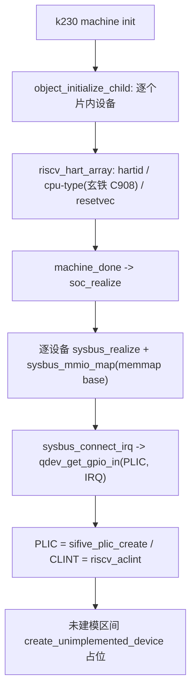
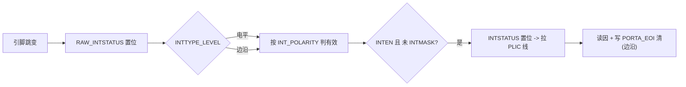
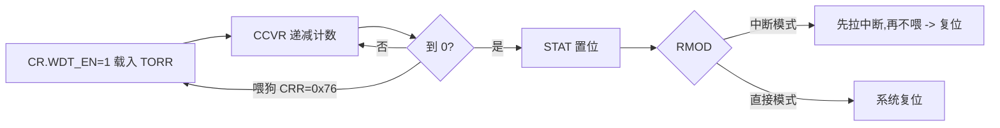
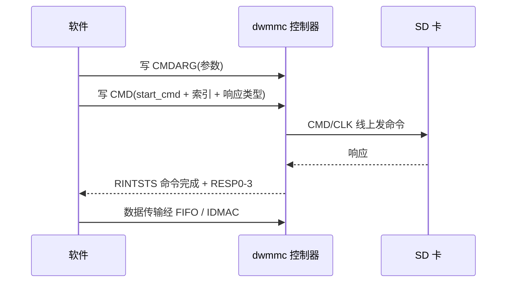
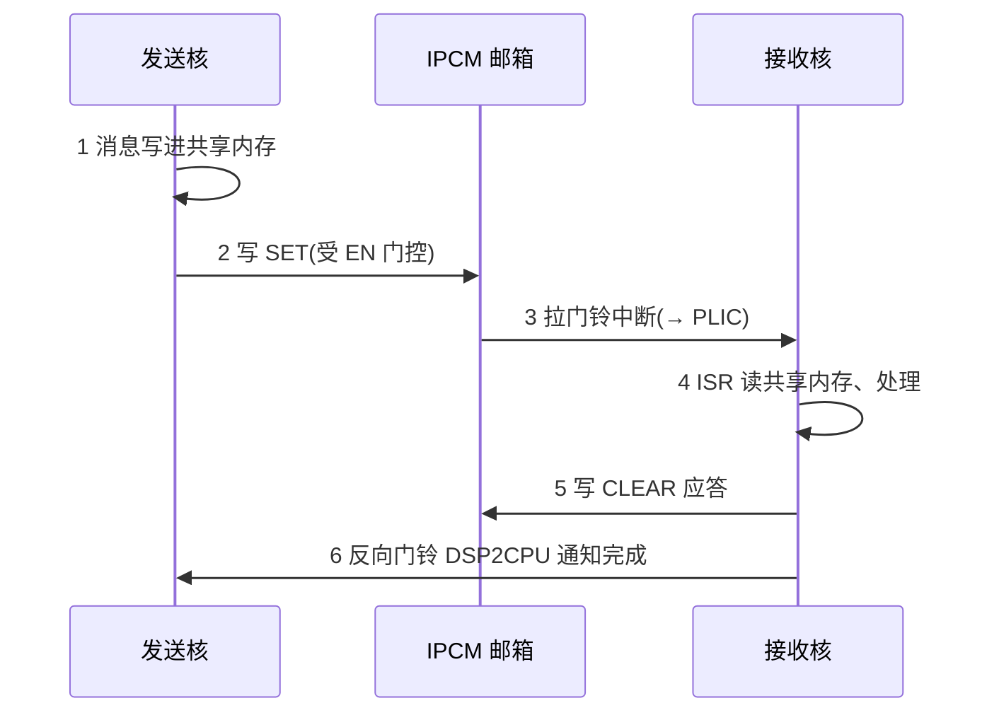
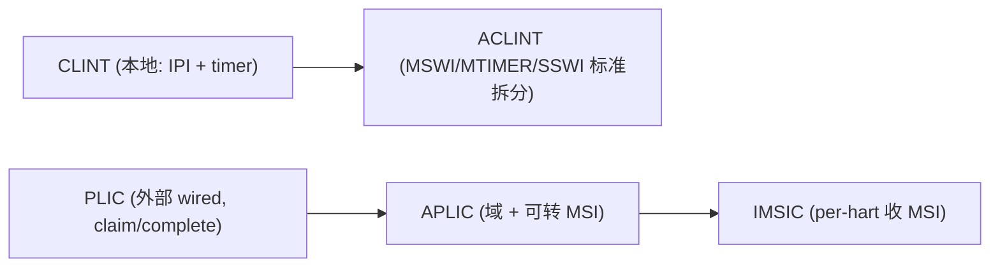

# QEMU K230 方向

!!! note "主要贡献者"

    - 作者：[@Lfan-ke](https://github.com/Lfan-ke)

---

K230 = Canaan Kendryte K230(RISC-V 玄铁 C908 双核 SoC)。本方向"数字星务"在 QEMU 里搭一块兼容 K230 SDK 的 virt 板 + 一批片内外设，再用这些设备做星务安全故障注入。寄存器与行为三处一手材料交叉溯源:K230 TRM v0.3.1、上游 Linux `pinctrl-k230`、Canaan `k230_sdk`。外设建模本身是标准的 QOM / sysbus 那套 (`MemoryRegionOps` + `realize` + `sysbus_init_mmio/irq`),这里记 machine 层、设备清单、启动链、用法。

## machine 层套路 (hw/riscv/k230.c + include/hw/riscv/k230.h)

- `memmap[]`:一张 `{base, size}` 表，每个设备一个 `K230_DEV_*` 枚举下标，地址照 TRM/SDK。
- `soc_init()`:每个设备 `object_initialize_child`;CPU 用 `TYPE_RISCV_HART_ARRAY` 设 hartid / cpu-type / resetvec。
- `soc_realize()`:逐个 `sysbus_realize` + `sysbus_mmio_map(base)` + `sysbus_connect_irq(qdev_get_gpio_in(plic, IRQ))`;PLIC 用 `sifive_plic_create`,CLINT 用 `riscv_aclint`。
- 没建模的设备用 `create_unimplemented_device(name, base, size)` 占位，兜住落到这段地址的读写、不触发未映射访存异常;建了真实设备就删掉对应 unimp，两者别并存。
- 机器类型名 `MACHINE_TYPE_NAME("k230")`,命令行即 `-machine k230`。



## 任务涉及的外设列表

| 外设 | 基址 | 说明 |
| :--: | :--: | :--: |
| CPU / C908 hart | - | 玄铁 C908,`riscv_hart_array` |
| DDRC / DDR | 0x00000000 | 主存 2GB 窗口 |
| SRAM | 0x80200000 | 片内 SRAM 2MB |
| BootROM | 0x91200000 | 复位向量入口 |
| PLIC | 0xF00000000 | `sifive_plic_create` |
| CLINT/ACLINT | - | `riscv_aclint`(mtimecmp/msip) |
| UART0-4 | 0x91400000 | DW_apb_uart(16550),IRQ 16-20 |
| WDT0/1 | 0x91106000 | DW_apb_wdt 看门狗 |
| CMU | 0x91100000 | 时钟管理 |
| RMU | 0x91101000 | 复位管理 |
| IOMUX/pinctrl | 0x91105000 | 64 针 pin-config(pin×4),照 Linux pinctrl-k230 |
| SD/SDHCI | 0x91580000 | DesignWare Mobile Storage(dwmmc) |
| QSPI0/1 | 0x91582000 | DW_apb_ssi(QSPI) |
| flash window | - | flash 映射窗口 |
| GPIO0/1 | 0x9140B000 | Synopsys DW_apb_gpio，逐针 IRQ 32-63 / 64-95 |
| I2C0-4 | 0x91405000 | DW_apb_i2c |
| SPI | 0x91584000 | DW_apb_ssi |
| TIMER | 0x91105800 | DW_apb_timers |
| RTC | 0x91000C00 | date/time/alarm,IRQ 175 |
| PMU | 0x91000000 | 电源管理单元 |
| PWR | 0x91103000 | 电源域 (TRM 无位级 spec) |
| HI_SYS_CFG | 0x91585000 | 系统配置 (TRM 无位级 spec) |
| mailbox/IPCM | 0x91104000 | 核间门铃 + 128 硬件自旋锁 (@0xA0),IRQ 109/110 |
| DMA | 0x80804000 | 通用 DMA |
| GSDMA | 0x80800000 | 图形/安全 DMA |
| decomp_gzip | 0x80808000 | gzip 硬件解压 |
| PWM | 0x9140A000 | ×2，复用上游 SiFive PWM |

memmap 还列了一大片 AI / 多媒体加速器 (KPU L2 cache / FFT / AI-2D / ISP / dewarp / CSI / H264 / 2.5D / VO / 3D 引擎等，0x8040_0000-0x90A0_0000) 与 USB / ADC / CODEC / I2S / TS 温感 / STC / SECURITY。没建真实寄存器行为的地址区间用 `create_unimplemented_device` 占位，兜住 SDK / 内核对这些地址的探测读写、不触发未映射访存异常。无位级手册的设备 (PWR / HI_SYS_CFG:TRM 只给功能描述 + 基址、无寄存器位定义) 也只占位，不塞 R/W 桩硬凑假寄存器，等真 spec 出来再建。

## 内存与存储层次

外设之外，地址空间里一大块是各类内存 / 存储，也按"快小 → 慢大"分层：

- 掩膜 ROM(mask ROM / BootROM):出厂固化只读，存复位后第一条指令。g233 是 `VIRT_MROM`(放复位向量 + 跳到 `-bios`),k230 是 `BOOTROM`@0x91200000。
- SRAM:片内静态 RAM，快但小;DRAM 没起来前 SPL 就跑在它上面 (k230 `SRAM`@0x80200000,2MB)。
- DROM / IROM:有的 SoC 把只读区再拆成数据 ROM(DROM，存常量 / 查表) 和指令 ROM(IROM，存代码),本质是只读地址窗口，常由 flash 映射而来;K230 没单列 (统一叫 BootROM),但概念归这类。
- DRAM / DDR:主存，大、可读写，放内核 + rootfs;`DDRC`(+ `DDRC_CFG`) 是它的控制器 (k230 DDR 挂 0x0 起、最大 2GB，即 0x0-0x80000000 窗口;实板如 CanMV-K230 只 512MB)。
- Cache(icache / dcache / L2):真机用来加速热数据。**QEMU(TCG 功能级) 不建 cache**,访存经 softmmu 的软件 TLB(地址翻译缓存，不是数据 cache) 直通模拟内存;`fence.i` / `cbo.clean`·`cbo.flush`·`cbo.inval`(Zicbom)/ cache-flush CSR 这类纯 cache 管理指令当 no-op 或屏障处理 (没真 cache 就不存在不一致);但 `cbo.zero`(Zicboz) 例外，它有架构规定的写效果，把对应 cache-block 对齐区域真清零，QEMU 照实执行、非 no-op。icache 与 dcache 的区分正是"哈佛架构 (指令/数据分开)vs 冯诺依曼架构 (统一)"那一层微架构，QEMU 停在 ISA/功能级、对软件呈现一块统一且始终一致的内存,不落地到这层。要 cache/流水线的周期级精度得用 gem5 这类模拟器。像 KPU `L2 cache`@0x80000000 在 QEMU 里也只占地址、不模拟命中 / 未命中。
- softmmu 的边界 (CPU 访存 vs 设备 DMA):softmmu 那套软件 TLB **只管 CPU 取指 / load-store 的地址翻译**。设备 DMA 是另一条路，绕开 CPU 与 softmmu，直接走 `dma_memory_read/write`(底层 `address_space_*`) 读写 guest 物理内存;要给设备地址做翻译则是 **IOMMU**(设备侧的 MMU，如 SMMU / RISC-V IOMMU),和 CPU 的 softmmu 是两套互不相干的翻译。设备的 DMA 建模 (描述符环、`dma_memory_*` 搬数据) 归设备侧，不在 softmmu 里。
- flash(NOR / NAND / QSPI):非易失，存固件 / rootfs。NOR 可 XIP(就地执行),NAND 要先拷进 RAM 再跑。

一句话:ROM 启动 → SRAM 撑早期 → DDR 当主存 → cache 加速 → flash 做持久，越靠前越快越小。

## 顺带了解一下:RISC-V 模拟器谱系 (Spike / QEMU / gem5)

同是"跑 RISC-V",几个模拟器定位差别很大：

| 维度 | Spike | QEMU | gem5 |
| :--: | :--: | :--: | :--: |
| 定位 | ISA 参考金模型 | 通用系统模拟器 | 微架构 / 周期级 |
| 架构 | 仅 RISC-V | 多架构 | 多架构 |
| 执行 | 逐指令解释 | TCG 动态翻译 (JIT) | 详细流水线建模 |
| 速度 | 慢 | 快 | 很慢 |
| 设备 / 系统 | 极简 (HTIF + CLINT，跑 pk/bbl 裸机) | 全套设备 / 板子 / virtio，跑完整发行版 | 可配 |
| Cache / 时序 | 不建 (功能级) | 不建 (功能级) | 建 (cache / 分支 / 时序) |
| 典型用途 | ISA 一致性 / 新扩展参考 / 差分测试 | OS / 固件 / 系统开发 | 性能 / 微架构研究 |

- Spike 是 RISC-V 官方黄金参考：逐指令解释、严格对谱，`spike -d` 交互调试、commitlog(`--log-commits`) 打印每条指令改了哪些寄存器 / 内存，做新指令 / 扩展时拿它当"标准答案",和 QEMU 或自研核差分比对：给核加自定义指令时，用它验证指令语义对不对。
- QEMU 靠 TCG 把 guest 指令 JIT 成宿主码，快得多，还带整套设备 / 板子，能跑完整 Linux，本训练营就用它。功能级、不建 cache(见上)。
- 要 cache / 流水线 / 分支预测的周期级精度，才上 gem5，慢得多，做性能与微架构研究。
- 三者里只有 gem5 建微架构;Spike 与 QEMU 都是功能级、都不模拟 cache 与流水线时序。

## 外设行为详解

K230 的片内外设大多是 Synopsys DesignWare `dw-apb-*` 系列 IP，寄存器模型公开 (DesignWare databook / 上游 Linux 驱动),照它建模即可。看外设有条主线：**功能从最简一步步往上垒**:像 GPIO 从"一根引线 0/1 读写"垒到中断、复用、ADC/DAC;PWM 从一路垒到多路多频;中断控制器从 PLIC 垒到 APLIC。下面按职能过一遍关键外设。

### GPIO(DW_apb_gpio)

职能：通用输入输出 + 逐针中断。寄存器分两组：

- 数据：`SWPORTA_DR`(输出值)、`SWPORTA_DDR`(方向，1=输出)、`EXT_PORTA`(读实际引脚电平)。
- 中断：`INTEN`(逐针使能)、`INTMASK`(屏蔽)、`INTTYPE_LEVEL`(电平 0 / 边沿 1，寄存器名带 LEVEL 但 0 才是电平敏感)、`INT_POLARITY`(极性)、`INTSTATUS`(屏蔽后挂起)、`RAW_INTSTATUS`(原始，未过 mask)、`PORTA_EOI`(写 1 清边沿中断)、`DEBOUNCE`(去抖)。
- k230:GPIO0 的 32 针接 PLIC 32-63、GPIO1 接 64-95(逐针一根线)。
- 功能是逐级往上垒的：最简的 GPIO 就是往外接一根引线、只有 0/1 内外读写 (`SWPORTA_DR` 写出、`EXT_PORTA` 读回);往上加一层就是逐针中断 (上面那组中断寄存器，能感知引脚跳变);再往上引脚经 IOMUX 复用成 UART·I2C·SPI 等功能脚;更往模拟侧递进就是 ADC(把引脚模拟电平量化成数字读)/ DAC(数字写成模拟电平输出),从纯数字 0/1 一步步长到模拟量。QEMU 建的是这些的数字寄存器面 (采样值 / 电平由数字侧给),模拟前端不建。



### WDT(DW_apb_wdt)

职能：看门狗，超时不喂就中断或复位。`CR`(WDT_EN 使能 / RMOD 超时动作：先中断再复位 或 直接复位 / RPL 复位脉冲长度)、`TORR`(超时区间选择)、`CCVR`(当前计数，RO)、`CRR`(计数重启：写魔数 `0x76` = 喂狗)、`STAT`(中断挂起)、`EOI`(读清中断)。



### UART(DW_apb_uart,16550 兼容)

职能：异步串口。`RBR/THR`(读=收、写=发)、`DLL/DLH`(波特率分频，靠 `LCR.DLAB=1` 切过去)、`IER`(收/发中断使能)、`IIR/FCR`(中断标识 / FIFO 控制)、`LCR`(帧格式：数据位/停止位/校验)、`LSR`(`DR` 有数据 / `THRE` 发送空)、`MCR/MSR`(流控)。RustSBI 认它:DTB compatible 写 `snps,dw-apb-uart`、`reg-shift=2`(寄存器 4 字节对齐)。

### I2C / SPI / QSPI(DW_apb_i2c / DW_apb_ssi)

- I2C(`DW_apb_i2c`):`CON`(主从 / 速率)、`TAR`(目标从地址)、`DATA_CMD`(写=发数据;bit8 读/写、bit9 STOP、bit10 RESTART)、`INTR_STAT`/`RAW_INTR_STAT`、`STATUS`(`TFE` 发空 / `RFNE` 收非空)、TX/RX FIFO。一次传输 = 设 `TAR` → 往 `DATA_CMD` 压命令 → 轮询/中断收结果。
- SPI/QSPI(`DW_apb_ssi`):`CTRLR0`(帧格式/位宽/SPI 模式 CPOL·CPHA)、`CTRLR1`(连读帧数)、`SSIENR`(使能)、`SER`(片选)、`DR`(数据 FIFO)、`SR`(`TFE`/`RFNE`/`BUSY`)、`BAUDR`(SCLK 分频)。

### SD/SDHCI(DesignWare Mobile Storage,dwmmc)

职能:SD/MMC 主控。`CTRL`(复位/中断使能)、`CMD`(`start_cmd` 位 + 命令索引 + 期望响应类型)、`CMDARG`(命令参数)、`RESP0-3`(卡响应)、`RINTSTS`(命令完成/数据完成/错误)、`STATUS`(FIFO 计数/忙)、数据经 FIFO 或 IDMAC。



### RTC / TIMER / PWM

- RTC(k230 自研):date/time/alarm 三组 + 1Hz 计时、写保护、掩码闹钟 (IRQ 175)、`TICK_EN` 周期中断、亚秒实时 `COUNT` 寄存器、闰年年闹钟修正。
- TIMER(`DW_apb_timers`):`LoadCount`(初值)、`CurrentValue`(RO)、`ControlReg`(使能 / 周期重载 或 free-running 自由运行 / 中断掩码;无 one-shot 档)、`EOI`(读清)、`IntStatus`。
- PWM(复用上游 SiFive):功能也是递进的：最简一路 = 一个计数器 + 一个比较值 (`pwmcount` 到 `pwmcmp` 翻转输出，得定频定占空比);SiFive 这版是四路 (`pwmcmp0-3`,四路独立占空比);再往上是多通道 / 可变频、死区与互补输出、边沿对齐 vs 中心对齐等变体 (电机 / 电源控制常用)。寄存器 `pwmcfg`(分频 / 比较模式 / sticky)、`pwmcount`、`pwmcmp0-3`。

以上寄存器模型可回 Synopsys DesignWare `DW_apb_*` databook、上游 Linux 对应驱动、SiFive PWM 规格核对。

### mailbox / IPCM(核间通信)

mailbox / IPCM(Inter-Processor Communication Module) 是**核间通信邮箱**。SoC 里不止一个处理器 (K230 双 C908 + KPU / 协处理器),它们共享 DRAM，但要一套硬件机制互相打招呼，这就是它干的活。两条腿：

- **门铃 (doorbell)**:一个 MMIO 触发寄存器，发送核写一下，硬件给接收核拉一根中断线;接收核靠中断被叫醒、不用忙轮询。
- **消息体走共享内存**:邮箱本身不搬大数据，只发信号。真正的消息放在双方都能看到的一段 DRAM / SRAM(通常是个环形缓冲)。一句话：门铃发信号、共享内存装货。

为什么要硬件而非一个共享 flag:普通共享 flag 双方读写有竞态、接收方还得忙轮询;门铃给的是原子、中断驱动的信号，一次 MMIO 写就变成对端一根 IRQ，还能干净跨时钟 / 电源域 (协处理器可能在别的域)。

流程 (以 K230 的 `CPU2DSP` / `DSP2CPU` 双向为例):



K230 的 IPCM 寄存器 (每方向一套，0x00-0x24):

| 寄存器 | 作用 |
| :--: | :--: |
| `EN` | 门控：使能 / 屏蔽这条门铃 |
| `SET` | 写它 = 拉门铃 (给对端发中断) |
| `CLEAR` | 写它 = 应答、清挂起 |
| `STATUS` | 读挂起状态 |
| `ERR` | 错误状态 |

两条门铃线接 **PLIC 109 / 110**(一方向一根);消息负载走共享内存，**邮箱硬件本身无数据 FIFO**(SDK 里叫 `DATAFIFO` 的组件是建在共享内存上的软件环形缓冲、只传数据指针，非邮箱硬件 FIFO)。

0xA0 处那 **128 个硬件自旋锁**:IPCM 还带一排硬件自旋锁 (hardware spinlock / HW mutex)。两个**异构**核可能不共享一致性缓存、甚至没有共同的原子指令，普通软件自旋锁跨核不可靠;硬件自旋锁给的是跨核原子锁：每个锁一个寄存器，读它 = 硬件 test-and-set(读回之前是否空闲、同时占住),写它 = 释放，拿来护住那个共享消息环。Linux 有专门的 `hwspinlock` 框架 (OMAP / STM32 / 高通都用),K230 摆了 128 个。

同款换个名而已：这套"门铃 + 共享内存 + 硬件锁"是通用配方，ARM MHU、STM32 IPCC、TI OMAP mailbox、NXP MU、高通 SMP2P/SMEM 全是它;软件层常见 RPMsg 栈 (remoteproc + virtio + mailbox) 跟协处理器讲话。别和 IMSIC 混：那是设备到 hart 的中断投递，邮箱是核到核的消息通道。

QEMU 建模：一个 `MemoryRegionOps`,写 `SET` 就 `qemu_set_irq` 拉 PLIC 线、写 `CLEAR` 拉低;128 个自旋锁 = 128 个 test-and-set 语义寄存器。没数据 FIFO 要建，负载就是 guest 本来就有的普通 RAM。

## 其他常用外设 (SoC 通识)

K230 之外，嵌入式 SoC 还常见这几类外设，一并认识;QEMU 里大多有现成模型可复用或参考。

### CAN 总线

职能：多主、实时、带仲裁的差分总线 (汽车/工控)。帧 = SOF + 仲裁域 (11 或 29 位 ID,ID 数值小者优先级高) + 控制域 (DLC 数据长度) + 数据 (0-8 字节) + CRC + ACK。控制器 (bxCAN / SJA1000 / CTU CAN-FD) 寄存器：模式 `MOD`、命令 `CMR`(发送请求)、状态 `SR`、收发邮箱 + 过滤器 (按 ID 掩码收)。QEMU 现成的 CAN 卡设备是 `kvaser_pci` / `pcm3680_pci` / `mioe3680_pci`(内含 SJA1000 芯片模型) 与 `ctucan_pci`(CTU CAN-FD),挂法 `-object can-bus,id=canbus0 -device kvaser_pci,canbus=canbus0`;`can_sja1000` 只是被这些卡内嵌的芯片模型、不能直接 `-device`。


### USB

职能：主机 - 设备分层总线，三种角色 host(控) / device(从) / OTG(可切)。控制器分两类：

- host:xHCI(USB3) / EHCI(USB2) / OHCI(USB1),寄存器标准化 (xHCI 分 capability / operational / runtime / doorbell 区)。
- device / OTG:Synopsys DWC2 / DWC3,`GOTGCTL`/`GAHBCFG`/`GUSBCFG` + 每端点 IN/OUT 寄存器。
- 传输分控制 / 批量 / 中断 / 等时四类，靠端点 + 描述符组织。K230 的 USB0/1(0x91500000 / 0x91540000) 是 DWC 系 (本方向占位未建行为)。命令行现挂 `-device qemu-xhci`(host)+ `-device usb-kbd/usb-storage`(设备);DWC2 是板子接线的 sysbus 模型 (QOM 名 `dwc2-usb`,源文件 hw/usb/hcd-dwc2.c),由板级实例化(如 raspi),不像 PCI 的 qemu-xhci 那样能 `-device` 现挂。

### 以太网 / 网卡 (NIC) / 音频 (I2S + CODEC) / ADC

- 以太网 (网卡 / NIC):真实网卡 = MAC(收发 / 地址过滤 / 校验与 TSO 卸载)+ PHY(物理层收发)+ MDIO(MAC 经它配 PHY)+ DMA(收发**描述符环**:每描述符指一段缓冲 + 状态位，硬件与驱动靠 `own` 位交接所有权),典型 IP 如 Synopsys DW GMAC。注意 K230 SoC 本身**无片上以太网 MAC**(高速 IO 只有 USB2.0 OTG / SDxC / SPI / MIPI),板子联网靠外置 USB 转以太网。QEMU 模拟真实网卡是逐寄存器建模：`e1000` / `e1000e` / `rtl8139`,GMAC 家族则是 `cadence_gem` / `npcm-gmac` / `allwinner-sun8i-emac` 等具体型号 (没有裸 `-device GMAC`),guest 跑对应真驱动。
- I2S + CODEC:I2S 走串行音频帧 (BCLK / LRCLK / SD),CODEC 管 ADC/DAC + 音量混音;K230 有 CODEC(0x9140E000)+ I2S(0x9140F000)。
- ADC:采模拟量，寄存器 = 通道选择 + 启动 + 结果 + 完成中断;K230 ADC @0x9140D000。

### virtio 半虚拟化设备 (net / gpu / sound)

QEMU 里除了逐寄存器模拟真实外设，还有一类 **virtio** 半虚拟化设备：不照某块真硬件建模，而是 guest 跑 virtio 驱动、与宿主共享一组环形缓冲直传数据，省掉真硬件寄存器时序，吞吐接近原生。

- 核心机制：每个 virtio 设备有若干 **virtqueue**。经典 split ring = 描述符表 + available 环 + used 环 (都在 guest 内存;virtio 1.1+ 另有单环的 packed 布局)。guest 挂缓冲进描述符、更新 available 环、写通知寄存器踢一脚 (kick);宿主处理完填 used 环、回注中断。能力靠 feature bits 协商。
- 三种传输:virtio-pci、**virtio-mmio**(riscv / embedded virt 板常用，设备名如 `virtio-net-device`)、virtio-ccw(s390)。


- **virtio-net**(网):RX / TX(+ 控制) 队列;guest 驱动 `virtio_net`;宿主后端接 tap / user，数据面可用 vhost-net(内核加速 tap) 或 vhost-user(DPDK) 卸载。挂 `-netdev tap,id=n0 -device virtio-net-device,netdev=n0`,比模拟 `e1000` 快得多。
- **virtio-gpu**(视频 / 显示):控制队列 (建资源 / set-scanout / transfer / flush)+ 光标队列;guest 驱动 `virtio_gpu`(DRM/KMS)。2D 把一个资源经 SET_SCANOUT 绑到一路 scanout、再 RESOURCE_FLUSH 刷上屏 (每路只显一个资源，多面合成在 guest 侧);3D 经 virglrenderer 把 guest 的 GL 命令翻成宿主 GL(virgl),Vulkan 走 venus。挂 `-device virtio-gpu-pci` / `virtio-gpu-gl-pci`(带 virgl)/ `virtio-vga`。
- **virtio-sound**(音频，QEMU 8.2+):控制 / 事件 / TX(放音)/ RX(录音) 队列;guest 驱动 `virtio_snd`(ALSA)。挂 `-device virtio-sound-pci,audiodev=au0 -audiodev pa,id=au0`。

音视频在 QEMU 里的通路 (对照 K230 真硬件):

- 音频：真机是 I2S + CODEC(见上);QEMU 要么用真前端 (`intel-hda` + `hda-duplex` / `AC97`) 配 `-audiodev`(pa / alsa / sdl 等) 后端，要么直接 `virtio-sound`。
- 视频：真机是 CSI(摄像头入)→ ISP(图像处理)→ VPU(H.264/H.265/JPEG 编解码)→ VO(输出) 一条流水;这些加速器 QEMU 一般不建，显示直接用 virtio-gpu / virtio-vga / ramfb 顶替，摄像头与硬件编码在通用模拟里通常不覆盖。
- 和 K230 的关系：真机有 GMAC(网)、3D 引擎 / VO(显示)、CODEC(音) 这些真硬件;QEMU 里跑通用系统时常直接用 virtio-net / virtio-gpu / virtio-sound 顶替，不逐寄存器模拟那些加速器。

### 调试 (JTAG / RISC-V Debug)

职能：从外部停机、看 / 改核状态。RISC-V 官方 **Debug 规范 (0.13.2 / 1.0)** 把这套接口标准化，分几块，只列出、不逐一细化：

- 传输：**DTM**(Debug Transport Module) 对外一个 JTAG TAP(或 2 线 cJTAG),TAP 上有 `IDCODE` / `DTMCS` / `DMI` 寄存器;DTM 经 **DMI**(Debug Module Interface) 总线连 DM。
- 核心：**DM**(Debug Module),规范定义的寄存器块：`dmcontrol`(haltreq / resumereq / ndmreset / hartsel 选核)、`dmstatus`(allhalted / version)、`hartinfo`、`abstractcs`+`command`+`data0..11`(abstract command:读写 GPR/CSR/内存、quick access)、`progbuf0..15`(program buffer，让核跑一小段指令序列)、`sbcs`+`sbaddress`+`sbdata`(System Bus Access，不经核直接访存)、`haltsum`(多核 halt 汇总)。
- 断点：**Trigger Module**(硬件断点 / watchpoint),核内 `tselect` / `tdata1`(mcontrol) / `tdata2` CSR，支持执行 / 读 / 写地址匹配触发。
- 核侧调试态:hart 有 `dcsr`(debug 控制状态)、`dpc`(debug PC)、`dscratch0/1`;经 halt / `ebreak` / 单步 / trigger 进 debug mode。
- 功能递进：最简一个 halt + 单步，往上加断点 / watchpoint / 多核同停 / SBA 直访存。

板级 / FPGA 上的真实调试 (**OpenOCD** 当中间层):

- 链路 `gdb ↔ OpenOCD ↔ JTAG 适配器 ↔ DTM(TAP)↔ DMI ↔ DM ↔ hart`。OpenOCD 配 adapter 驱动 (ftdi / cmsis-dap / jlink)+ `transport select jtag` + riscv target，把 gdb 的读寄存器 / 下断点翻成 DM 的 abstract command;常用 `halt` / `reg` / `mdw` / `bp` / `load_image` / `resume` / `step`。
- FPGA 软核 (Rocket / CVA6 / Ibex / VexRiscv 等，DM 常由 `riscv-dbg` 生成) 两种接法：一是引出专用 JTAG 针接外部探针 (FT2232 / Olimex / J-Link);二是复用 FPGA 自身边界扫描:Xilinx 走 **BSCAN tunnel**(JTAG-to-DMI 穿过 `BSCANE2`,OpenOCD `riscv use_bscan_tunnel`),或用 **XVC**(Xilinx Virtual Cable,JTAG over TCP，接 Vivado hw_server) 当传输。接法列举即可，引脚 / 配置按各板手册。

QEMU 模拟调试：

- 不建完整 DM / DTM，直接用 **gdbstub** 把整条 OpenOCD + 探针 + DTM + DM 链一口气顶替：`-s -S`(即 `-gdb tcp::1234 -S`) 起 gdbstub 并冻在第一条指令，另一端 `gdb` / `target remote :1234` 直连，效果等价于连了 JTAG 调试器，但省掉物理探针与 OpenOCD 中间层;配 `-d` 事件日志、record/replay 还能做反向调试。

### RNG(硬件随机数)

职能：硬件熵源 / 随机数发生器。最简寄存器 = `STATUS`(数据就绪位)+ `DATA`(读一个随机字);往上加中断、FIFO、在线健康检测。QEMU 现成 `bcm2835_rng` / `imx_rngc` / `virtio-rng`,建模就是"读 DATA 给个随机值、置就绪位"。

### PS2(键鼠输入)

职能：老式键盘 / 鼠标接口。PS2 控制器 (常配 i8042)+ 键盘 / 鼠标设备：主机读 `DATA`(键盘 scancode / 鼠标数据包)、看 `STATUS`、写 `CMD` 配置，设备有数据就拉中断。QEMU 现成 `hw/input/ps2.c`。

### ARCHINFO / 芯片信息寄存器

职能：一组**只读**身份 / 能力寄存器，报芯片 ID、版本、feature bits、核数等，给固件 / 驱动探测用 (类比教学设备 `edu` 的版本寄存器：几个只读 MMIO 返回固定 ID / 版本值)。最简就是几个只读 MMIO 寄存器返回固定值，不需状态机，是"认识一块芯片"的入口。

TIMER、UART 前面已讲 (`DW_apb_timers` / `DW_apb_uart`)。

## 外设的开源参考实现 (HDL / 模拟器代码)

K230 片内 IP 多是 Synopsys DesignWare,databook 闭源;但同一类外设在开源 RISC-V 硅项目里有可综合的真实 HDL，寄存器模型与行为同构，吃透一个外设，除了看上游 Linux 驱动 (软件视角),还能回这些开源硬件对读 (硬件视角)。另一路是 QEMU 自己 `hw/` 下的 C 行为模型 (本营就建在其上),那是模拟器视角的直接范本。三处对读，尤其能补上 K230 占位没建的那批 (SECURITY / RNG / ADC / USB / I2S)。

| 外设类 | 开源参考实现 | 形态 | 覆盖 |
| :--: | :--: | :--: | :--: |
| UART/GPIO/SPI/I2C | OpenTitan `hw/ip/`、PULP `apb_*` | SystemVerilog | 全套 APB 外设，合成级 + DV |
| PWM/Timer | OpenTitan `pwm`/`rv_timer`、PULP `apb_adv_timer`、SiFive sifive-blocks | SV / Chisel | 计数比较 → 多路 → 死区 |
| ADC | OpenTitan `adc_ctrl` | SystemVerilog | 通道扫描 + 阈值中断 |
| USB | OpenTitan `usbdev`、QEMU `hcd-dwc2` | SV / C 模型 | device 全栈 / DWC2 主控模型 |
| I2S / 音频 | PULP `udma_i2s`、OpenCores i2s、QEMU `wm8750` | SV / C | 串行音频帧 + CODEC |
| DMA | PULP `udma`、QEMU `dma_memory_*` | SV / C API | 描述符 / 通道搬运 |
| RNG / 熵源 | OpenTitan `csrng`+`edn`+`entropy_src`、QEMU `virtio-rng` | SV / C | CTR_DRBG + 在线健康检测 |
| SECURITY(密码) | OpenTitan `aes`/`hmac`/`kmac`/`keymgr`、OpenCores aes/sha | SystemVerilog | AES/HMAC/KMAC + 密钥管理 |
| JTAG / RV Debug | pulp-platform `riscv-dbg` | SystemVerilog | 官方 RISC-V Debug 0.13 DM/DTM |
| CLINT/PLIC | rocket-chip、OpenTitan `rv_plic`、QEMU `sifive_*` | Chisel / SV / C | 本地 IPI+timer / 外部中断 |
| NPU/KPU(AI) | NVDLA、Berkeley Gemmini | Verilog / Chisel | 卷积 / 脉动阵列加速器 |
| FFT | ZipCPU dblclockfft、OpenCores fft | Verilog | 流水线 FFT |

分析 (挑要点):

- OpenTitan(lowRISC，核用 RISC-V Ibex) 覆盖面最全：`hw/ip/<名>/rtl/` 下每个外设都是可综合 SystemVerilog + DV 验证，寄存器还带机器可读 `.hjson` 描述、由 reggen 自动生成寄存器块，读它比啃闭源 databook 直观。安全类 (aes/hmac/kmac/keymgr)、熵源 (csrng/edn/entropy_src)、adc_ctrl、usbdev 正好对上 K230 占位没建的 SECURITY / RNG / ADC / USB。
- PULP(ETH Zürich + 博洛尼亚) 走 APB 外设 + uDMA 子系统：`apb_uart`/`apb_gpio`/`apb_i2c` + `udma_i2s`/`udma_qspi`,外设经 uDMA 直接搬进内存，演示了 I2S / DMA 的真实通路;JTAG 侧 `pulp-platform/riscv-dbg` 是官方 RISC-V Debug 规范的参考实现 (DM/DTM/abstract command 齐全),被 CVA6 等主流开源核直接复用。
- QEMU `hw/` 是模拟器代码侧的直接范本:USB 有 `hcd-dwc2`(和 K230 的 DWC 系同源) 与 xhci/ehci/ohci;音频 CODEC 有 wm8750;RNG 有 virtio-rng。这些 C 模型正是"只建寄存器功能面、不建物理层"的样板，和本营建 K230 外设一个思路。
- AI / 多媒体加速器 (KPU/FFT/ISP/H264/3D…) 开源硬件稀:NPU 类可参考 NVDLA(NVIDIA 开源 Verilog) 与 Berkeley Gemmini(Chisel，挂 rocket-chip),FFT 有 ZipCPU dblclockfft;但 ISP/H264/VO/3D 引擎多为厂商闭源或只有软件参考，QEMU 里也只能停在占位或寄存器桩。

> 源:OpenTitan github.com/lowRISC/opentitan(`hw/ip/`)、PULP github.com/pulp-platform(`apb_uart`/`udma`/`riscv-dbg`)、SiFive github.com/sifive/sifive-blocks、OpenCores opencores.org、NVDLA github.com/nvdla/hw、Gemmini github.com/ucb-bar/gemmini、dblclockfft github.com/ZipCPU/dblclockfft、QEMU `hw/`(`usb/hcd-dwc2.c` 等)。

## 中断控制器:CLINT/ACLINT 与 PLIC/APLIC(职能对比 + 协议演化)

RISC-V 把中断分两摊：本地中断 (软件 IPI + 定时器，每 hart 自己的) 归 CLINT/ACLINT;外部设备中断归 PLIC/APLIC。两条线都从"老式"演化到 AIA(Advanced Interrupt Architecture) 标准化版本。

| 控制器 | 管什么 | 分发方式 | 关键机制 |
| :--: | :--: | :--: | :--: |
| CLINT | 软件中断 (MSIP / IPI)+ 定时器 (MTIME / MTIMECMP) | 本地、每 hart | 写 MSIP 触 IPI;MTIME ≥ MTIMECMP 触定时器 |
| ACLINT | 同上，拆成 MSWI + MTIMER + SSWI 三块 | 本地、模块化可分布 | CLINT 的标准化拆分，S 态也有 SSWI |
| PLIC | 外部设备线中断 (wired) | 每 hart context:阈值 + 使能 + claim/complete | 轮询式 claim 读最高优先级源、complete 应答 |
| APLIC | 外部中断，可 wired 也可转 MSI | 域 (M/S),直投或经 IMSIC 发 MSI | AIA 一部分，虚拟化友好 |
| IMSIC | 每 hart 收 MSI | 每个 interrupt file 一个 4-KiB 页 (hart 的 M/S 级各一) | 设备写页内 `seteipnum_le`、数据=中断号 i 置 pending;免 claim 轮询 |



K230 与 g233 都用传统组合：`riscv_aclint`(CLINT/ACLINT)+ `sifive_plic`(PLIC);上游 virt 板可选 AIA(`-machine virt,aia=aplic` 或 `aia=aplic-imsic`) 切到 APLIC(+IMSIC)。设备中断走 PLIC/APLIC、核间 IPI 与定时器走 CLINT/ACLINT,两者互不越界。

## 启动最小 Linux 要哪些外设 (联系 SBI 最小扩展)

跑起一个能进 shell 的最小 RISC-V Linux，硬件侧其实没几样：

- 内存 (DDR):放内核 + rootfs。
- CPU/hart:rv64 带 S 态。
- 定时器 + IPI(CLINT/ACLINT):调度 tick 与核间中断。但 S 态 Linux 不直接摸 CLINT，而是经 SBI 调用，由 M 态 SBI 固件 (OpenSBI / RustSBI) 替它操作。
- 外部中断控制器 (PLIC/APLIC):至少给串口一根 irq。
- 串口 (UART,ns16550 / dw-apb-uart):`earlycon` + `console=ttyS0` 出日志、进 shell。
- SBI 固件：提供下面这组扩展。

DTB 把上面这些描述给内核。SBI 侧，Linux 依赖的最小扩展约 6 个：

| 扩展 | 作用 |
| :--: | :--: |
| Base | 探测版本 / 实现 / 有哪些扩展 (必备) |
| TIME | 设下一次定时器中断 (替代直接写 mtimecmp) |
| IPI | 发核间中断 (替代直接写 msip) |
| RFENCE | 远程 fence(TLB / I-cache 跨核同步) |
| HSM | hart 状态管理 (SMP 上下线 / 启动从核) |
| SRST | 系统复位 / 关机 |

(DBCN 调试控制台可选：没串口时也能靠它经 SBI 出字。) 所以"最小外设集"= DDR + UART + CLINT + PLIC + SBI 固件，够进 shell;再往上整机也是一步步叠上去：要持久化就加块设备 (SD / flash)、要联网加以太网 (GMAC)、要图形/外接加显示 / USB……按需一层层垒。整个系统跟单个外设一样，都是从最简往上叠。

## RustSBI 启动链


- RustSBI prototyper(fork),retarget 固件地址到 k230 direct_boot 布局：`SBI_LINK_START_ADDRESS=0x8000000`,jump 模式 `JUMP_ADDRESS=0x8200000`。
- 手写 K230 DTB:uart 用 `snps,dw-apb-uart`(不是 `ns16550a`,否则 RustSBI 选错 UART 驱动 reg-shift 死锁)@0x91400000;clint compatible 写 `sifive,clint0`@0xf04000000(QEMU 侧其实用 `riscv_aclint` 实现，DTB 用这个 compatible 让 RustSBI 认);`memory@0` 覆盖 DDR 窗口 (最大 2GB)。
- payload 链接脚本让 `_start` 落在 `JUMP_ADDRESS` 首字节，否则跳进去跑飞。

## 用法：跑 k230 机器 + qtest

```bash
# 先确认机器在:
qemu-system-riscv64 -machine help | grep k230

# direct_boot:RustSBI + 内核 + DTB(照 direct_boot 布局精确落地址)
qemu-system-riscv64 -machine k230 -smp 2 -m 2G -nographic \
  -device loader,file=rustsbi-k230.bin,addr=0x8000000 \
  -device loader,file=Image,addr=0x8200000 \
  -device loader,file=k230.dtb,addr=0xa000000

# 或常规 -bios/-kernel(bios 放 SBI 固件):
qemu-system-riscv64 -machine k230 -smp 2 -m 2G -nographic \
  -bios rustsbi-k230.bin -kernel Image -dtb k230.dtb
```

qtest(寄存器级验证，不跑 guest):

```bash
cd build
# 逐设备:k230-{gpio,rtc,wdt,iomux,mailbox,pwm,dwmmc,safety}-test
./pyvenv/bin/meson test --no-rebuild "qtest-riscv64/k230-gpio-test"
# 一把跑全部 8 个
./pyvenv/bin/meson test --no-rebuild --suite qtest
```
