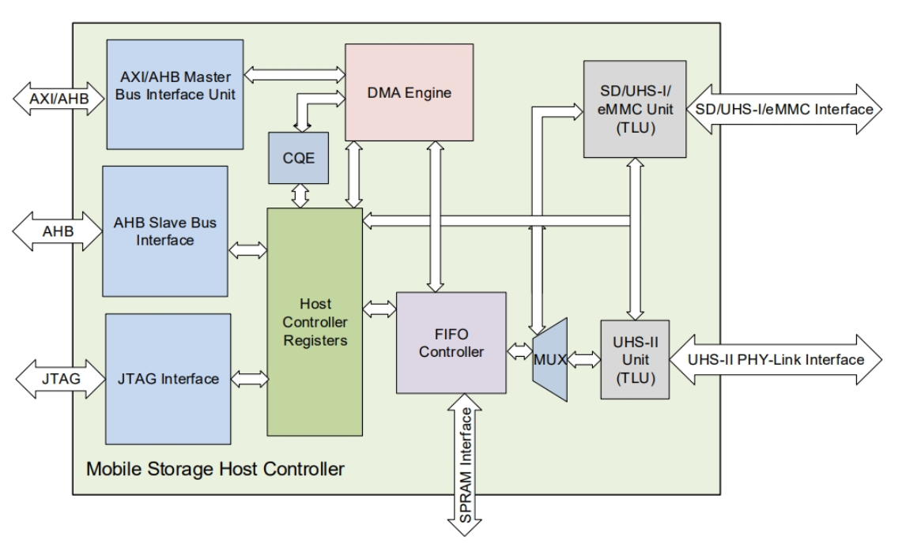

# QEMU 训练营 2026 项目阶段：K230 SDHCI 建模

!!! note "主要贡献者"

    - 作者：[@xiex386](https://github.com/xiex386)

---

本文总结 K230 eMMC/SD/SDIO控制器(SDHCI)的QEMU建模实现。
代码基于 QEMU`k230` machine，目标是让 K230 SDK 的 Linux 能够识别控制器，并完成基本 SD 卡访问。
当前版本已经完成了 Linux ADMA 文件系统读写验证，并向上游提交了[补丁](https://lore.kernel.org/qemu-devel/20260729105904.272939-1-xinxie908@gmail.com/T/#t)

## 1. 项目介绍

Kendryte K230 是一款面向 AIoT 场景的异构 RISC-V SoC。QEMU 上游已有`k230` machine 的基础支持，包括：

- 1 个 C908 小核
- PLIC 和 CLINT
- 5 个 UART
- 2 个 K230 watchdog
- 其他尚未建模的外设占位区域

在本工作开始前，K230 的两个 SD 控制器仍由`create_unimplemented_device()` 占位

本项目依据[K230 TRM](K230_Technical_Reference_Manual_V0.3.1_20241118.pdf)第 12.4 节，为 QEMU 增加 K230 DWC MSHC SDHCI 模型，并将其接入现有
`k230` machine

## 2. 总体架构

K230 SDHCI 型号应该为 Synopsys DesignWare Core Mobile Storage Host Controller，支持 SDHCIv4.20 标准。以下是 TRM 12.4 节描绘的 SD 控制器图：



左边的两个 AXI/AHB 连接系统总线，Master 用于 DMA，Slave 用于 CPU 访问设备寄存器，进行配置和命令下发；右边则是与 SD 卡/SDIO/eMMC 设备的通信接口

在 QEMU 中进行功能建模，可以忽略各种物理、电气特性，主要关心设备寄存器语义、数据传输和中断路径。由于 SDHCI 存在标准规范，QEMU 已经实现了一个通用 SDHCIv3 模型，囊括了`0x000-0x05f`范围的寄存器语义以及命令控制、数据传输等标准行为。而本工作要做的，主要是和 K230 TRM 中的差异部分，这至少包含以下几点：

- 功能特性上，QEMU 只支持到 SDHCIv3，缺少 v4.20 的 ADMA3(主要是命令打包)、UHS-II 等特性。虽然按照 TRM 的默认寄存器配置，K230 似乎关闭了 UHS-II
- 对于 SDHCIv3，QEMU 通用模型也并非完全支持，至少在寄存器上缺少了`0x060-0x06f`的 Preset Value
- K230 包含厂商特定的寄存器区域（`0x100`以后），以及指向这些区域的标准区域指针`0x0e0-0x0ec`

考虑到本项目是为 QEMU K230 机器提供更多的外设功能支持，因此 SDHCIv4.20 的 ADMA3 等高级功能暂不考虑，以 SDHCIv3 为目标，主要做以下几个点：

- 连接 QEMU 通用模型，进行 K230 的配置，如设备能力、UHS 版本等
- 补全 Preset Value 寄存器和厂商特定寄存器区域的指针
- 为支持 SD 卡正常读写，提供厂商特定寄存器的最小实现，主要是支持驱动对`PHY_CNFG`的轮询

整体数据和中断路径如下：

```text
                         K230 machine
                              |
                +-------------+-------------+
                |                           |
          K230SDHCIState[0]           K230SDHCIState[1]
          0x91580000 / IRQ142          0x91581000 / IRQ144
                |                           |
                +-------------+-------------+
                              |
                    4 KiB MMIO container
                              |
          +-------------------+-------------------+
          |                   |                   |
   generic SDHCI       K230 read-only      extension fallback
   command/PIO/DMA     preset/pointers     PHY/vendor storage
          |
        SDBus
          |
       SD card
          |
     BlockBackend

Interrupt path:

  SD card event -> generic SDHCI -> K230 SDHCI Container -> K230 PLIC -> C908
```

## 3. 实现概况

### 3.1 K230 SDHCI 建模

K230 提供两个 DWC MSHC 控制器：

| 控制器 | MMIO 基址 | 范围 | PLIC IRQ | 典型用途 |
| --- | --- | --- | --- | --- |
| SDHCI0 | `0x91580000` | `0x1000` | 142 | 板载存储/eMMC 接口 |
| SDHCI1 | `0x91581000` | `0x1000` | 144 | 外部 SD 卡接口 |

控制器前部兼容标准 SDHCI 寄存器，但整个 K230 MMIO 窗口为 4 KiB。标准寄存器之后还包含 Preset Value、SDHCIv4 扩展区指针、DWC MSHC PHY、Embedded Control 和 vendor-specific 区域

QEMU 的通用 `SDHCIState` 已经实现了核心 SD 协议和主要数据路径，但它的寄存器范围和功能集合不能直接完整描述 K230。因此本项目将其作为内嵌，附加额外的状态实现，核心状态结构如下：

```c
struct K230SDHCIState {
    SysBusDevice parent_obj;      // 使模型成为可映射 MMIO、可输出 IRQ 的 SysBus 设备

    MemoryRegion container;       // 对外提供完整的 4 KiB K230 控制器地址空间
    MemoryRegion iomem_fallback;  // 覆盖整个窗口，为尚无副作用模型的扩展寄存器提供存储
    MemoryRegion iomem_preset;    // 提供 `0x060` 到 `0x06f` 的只读 Preset Value
    MemoryRegion iomem_pointer;   // 提供 `0x0e0` 到 `0x0eb` 的只读扩展区指针
    BusState *bus;                // 保存内部通用 SDHCI 子设备的 `sd-bus`，供 machine 挂接 SD 卡
    uint8_t fallback_regs[K230_SDHCI_REG_SIZE]; // 保存 PHY、vendor 等扩展寄存器的可迁移状态

    SDHCIState sdhci;             // 内嵌的通用 `SDHCIState`，负责命令、FIFO、DMA 和中断状态
};
```

MMIO 寄存器：

| 偏移 | 区域 | 当前行为 |
| --- | --- | --- |
| `0x000-0x05f` | 标准 SDHCI | 通用 QEMU SDHCI 行为 |
| `0x060-0x06f` | Preset Value | 返回手册复位值 |
| `0x0e0-0x0eb` | Extension pointers | 返回手册指针值，写入被拒绝 |
| `0x100-0xfff` | 扩展区域 | 默认保存 guest 写入值，不模拟多数硬件副作用 |
| `0x300` | `DWC_MSHC_PHY_CNFG` | 除普通存储外，`PHY_PWRGOOD` 永久为 1 |

目前以下功能缺失，作为与 TRM 的差异在`capabilities`寄存器中显式声明：

- `ASYNC_INT`：QEMU `SDBus` 没有对应的异步 SDIO 中断输入
- `TIMER_RETUNING` 和 `RETUNING_MODE`：没有周期性 retuning 计时器
- `ADMA3`：通用 SDHCI 只实现到 ADMA2

模型最终配置为：

```text
sd-spec-version = 3
uhs             = UHS-I
data paths      = PIO / SDMA / ADMA2
```

### 3.2 在 K230 machine 中实例化

`K230SoCState` 保存两个控制器实例：

```c
K230SDHCIState sdhci[2];
```

SoC instance 初始化阶段通过 `object_initialize_child()` 创建 `sdhci0` 和
`sdhci1`。realize 阶段完成：

1. realize 两个 K230 SDHCI 设备；
2. 将其 MMIO 分别映射到 `0x91580000` 和 `0x91581000`；
3. 将 IRQ 分别连接到 PLIC source 142 和 144；

machine 初始化时按 drive index 查找 SD 后端：

```c
DriveInfo *dinfo = drive_get(IF_SD, 0, i);
```

找到后创建 `TYPE_SD_CARD`，设置对应 `BlockBackend`，再把卡 realize 到
`s->soc.sdhci[i].bus`，从而用户指定的 SD 卡可以经过 SDHCI 被主机驱动识别

## 4. qtest 设计

新增的 `k230-sdhci-test` 包含三个子测试

### 4.1 `/k230-sdhci/registers`

验证：

- capabilities 仅屏蔽模型明确不支持的功能
- Preset Value 与手册复位值一致且只读
- 扩展区指针与手册一致且只读
- `PHY_PWRGOOD` 始终置位
- vendor fallback 可读写
- SDHCI0 与 SDHCI1 的 vendor 状态相互隔离

### 4.2 `/k230-sdhci/card-detect`

测试在 SDHCI1 挂接临时镜像，推进虚拟时钟越过通用插卡延迟，然后验证：

- SDHCI1 的 `CARD_PRESENT` 置位
- 未插卡的 SDHCI0 保持无卡状态
- Command Complete 能从 SDHCI1 传播到 PLIC pending bit 144

### 4.3 `/k230-sdhci/card-io`

测试先在宿主镜像写入已知内容，再执行 SD 卡识别和 RCA 选择流程，最后：

- 通过 PIO 数据端口读取并比较内容
- 通过 PIO 写入新内容
- 退出 QEMU 后直接读取 backing file，确认数据确实落盘

运行命令：

```bash
cd qemu
ninja -C build qemu-system-riscv64

build/pyvenv/bin/meson test -C build \
    qemu:qtest-riscv64/k230-sdhci-test --print-errorlogs
```

当前结果：

```text
1/1 qemu:qtest-riscv64/k230-sdhci-test OK
3 subtests passed
```

## 5. Linux ADMA 验证

使用 `-kernel`、`-dtb` 和 `-initrd` 直接启动 K230 SDK Linux，并在 SDHCI1 挂接 32 MiB ext2 镜像：

```bash
truncate -s 32M /tmp/k230-direct-linux-sd.img
mkfs.ext2 -F /tmp/k230-direct-linux-sd.img

SDK=k230_sdk/output/k230_canmv_defconfig
qemu/build/qemu-system-riscv64 \
    -machine k230 \
    -kernel "$SDK/images/little-core/Image" \
    -dtb direct_linux.dtb \
    -initrd "$SDK/images/little-core/rootfs-final.cpio.gz" \
    -append "console=ttyS0,115200 earlycon=sbi cma=0" \
    -drive if=sd,index=1,format=raw,file=/tmp/k230-direct-linux-sd.img \
    -nographic
```

关键启动日志为：

```text
mmc0: SDHCI controller on 91580000.sdhci0 [...] using ADMA
mmc1: SDHCI controller on 91581000.sdhci1 [...] using ADMA
mmc1: new high speed SD card at address db3f
mmcblk1: mmc1:db3f QEMU! 32.0 MiB
```

进入 guest 后完成：

```bash
mount -t ext2 /dev/mmcblk1 /mnt/sd
printf 'k230-direct-linux-adma\n' > /mnt/sd/marker.txt
dd if=/dev/zero of=/mnt/sd/io.bin bs=65536 count=20
sync
md5sum /mnt/sd/io.bin
umount /mnt/sd

mount -t ext2 /dev/mmcblk1 /mnt/sd
cat /mnt/sd/marker.txt
wc -c /mnt/sd/io.bin
md5sum /mnt/sd/io.bin
```

验证结果：

- 两个控制器均由 Linux 选择 ADMA；
- SDHCI1 正确识别 32 MiB SD 卡；
- 1.25 MiB 文件卸载、重新挂载后长度保持 `1310720`；
- 写入前后 MD5 均为 `1045bfd216ae1ae480dd0ef626f5ff39`；
- 宿主机执行 `e2fsck -fn` 通过

## 6. 一些问题补充

### 6.1 PHY 与 vendor 区域

K230 SDK 驱动在控制器完全复位时会初始化 PHY，并轮询
`DWC_MSHC_PHY_CNFG.PHY_PWRGOOD`。如果该位永远为 0，驱动会超时，后续 SDHCI
探测无法进行

QEMU 没有模拟模拟电路、电源稳定时间或 PHY 故障条件，因此当前模型将
`PHY_PWRGOOD` 视为虚拟硬件的合成状态：

- 复位后立即为 1；
- 读取任何覆盖该字节的访问都能看到该位；
- guest 写 0 也不能将它清除。

其他大多数 PHY 和 vendor-specific 寄存器当前采用简单存储语义，允许驱动写入并读回配置值

### 6.2 U-Boot、Linux 与数据路径选择

K230 SDK 中两套软件的默认选择不同：

| 软件 | 当前配置/探测结果 | 主要路径 |
| --- | --- | --- |
| K230 U-Boot | 编译 `CONFIG_MMC_SDHCI_SDMA`，未启用 K230 ADMA 配置 | SDMA |
| K230 Linux | 根据 capability 同时发现 SDMA 和 ADMA2，并优先 ADMA2 | ADMA2 |
| qtest 基本 I/O | 直接访问 SDHCI Buffer Data Port | PIO |

当前 Linux 直接启动验证覆盖了 ADMA2。U-Boot 的大块 SDMA 传输还涉及 QEMU 通用 SDHCI 的 buffer boundary 处理 (见下个问题)，不方便由本工作解决

## 6.3. SDMA 边界问题与范围控制

开发过程中曾研究过 SDMA 到达 512 KiB buffer boundary 后的续传行为

按照 SDHCI 语义：

- 控制器在边界产生 DMA Interrupt。`Read Transfer Active` 或 `Write Transfer Active` 仍然保持 1，因为整个 SD 数据事务尚未完成
- 软件更新 SDMA System Address 后继续

**但 QEMU 通用 SDHCI 在 SDMA System Address 写入时会判断当前是否在进行传输，这个判断根据 `Read Transfer Active` 和 `Write Transfer Active`来判定，从而拒绝写入**

曾尝试放宽 QEMU 通用 `SDHC_SYSAD` 在传输活跃时的写入限制，但这个变化会影响所有使用通用 SDHCI 的 machine，需要独立的暂停状态、独立测试以及更广泛的上游审阅，超出了本工作的范围，因此最终放弃了对`qemu/hw/sd/sdhci.c` 的修改

## 7. 上游补丁拆分

为了便于 QEMU 社区审阅，当前工作拆分为三个提交：

### Patch 1：添加 K230 SDHCI 模型

```text
hw/sd: add Kendryte K230 SDHCI controller
```

包含模型源码、头文件、Kconfig、Meson 和 MAINTAINERS 更新

### Patch 2：在 K230 machine 中启用控制器

```text
hw/riscv: enable SDHCI controllers on K230
```

包含两个实例、MMIO/IRQ 映射、SD 卡连接和 `k230.rst` 文档更新

### Patch 3：添加 qtest

```text
tests/qtest: add K230 SDHCI tests
```

包含寄存器、卡检测、中断和 PIO 读写测试

当前三个补丁 checkpatch 检查结果为 0 errors、0 warnings

## 8. 总结与心得

本工作为 QEMU K230 提供了 SDHCI 支持，并尽量与 K230 TRM 手册对齐。
虽然由于通用模型的功能缺失不能完全对齐，但至少功能上能运行 SD 卡，也经过了 qtest 和 Linux 验证，并向上游提交了补丁

虽然由于其他工作繁忙，无法全身心投入，但总的来说是一次不错的实践，学习了 SD 和 QEMU 相关知识，锻炼了基础技术，而且参与开源项目贡献的体验很有趣，有人同行和共建的感觉很不错

## 9. 后续方向

- 跟进补丁进展
- 完善 SDHCIv4 功能，进一步与 TRM 对齐
- 反馈 QEMU 通用 SDHCI 模型关于 SDMA 的问题

## 参考资料

\[1] Kendryte. K230 Technical Reference Manual V0.3.1. <https://download.kendryte.com/developer/k230/HDK/K230%E7%A1%AC%E4%BB%B6%E6%96%87%E6%A1%A3/K230_Technical_Reference_Manual_V0.3.1_20241118.pdf>

\[2] SD Association. SD Host Controller Simplified Specification Version 4.20. <https://www.sdcard.org/downloads/pls/pdf/?f=PartA2_SD%20Host_Controller_Simplified_Specification_Ver4.20.pdf>

\[2] K230 SDK. <https://github.com/kendryte/k230_sdk>

\[5] QEMU 通用 SDHCI 模型。<https://github.com/qemu/qemu/blob/master/hw/sd/sdhci.c>

\[6] QEMU Camp 训练营。<https://qemu.gevico.online/>
